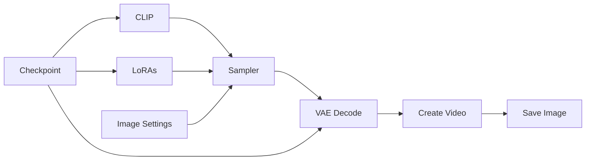

# Guide to ComfyUI - Text to Image (T2I)

## Basic Workflow Diagram

Although WAN 2.2 internally uses separate high-noise and low-noise stages, most ComfyUI workflows expose these stages as distinct nodes and checkpoints. The image and prompt are first converted into conditioning information, then the generation process is split into two phases. The outputs of these stages are combined to produce the final video. In Lightning workflows, specialized LoRAs are often applied to both stages, allowing the model to generate high-quality results with very few sampling steps.



## Required files

You only need a checkpoint file with the template. Optionally, you can have the LoRA files to apply. There are several templates and LoRAs available [here](https://civitai.com/), it will depend on your objective. 

## LoRAs

LoRAs (Low-Rank Adaptations) are small, specialized files used to modify or fine-tune a base checkpoint's behavior without altering the entire original model. In text-to-image (and text-to-video) workflows, they allow you to inject specific art styles, characters, poses, or structural concepts into your generation.

In ComfyUI, LoRAs are injected directly between the Checkpoint and the Sampler nodes. You can layer multiple LoRAs together, adjusting the strength of each individually to blend different styles or elements.

## Sampler

The Sampler is the core engine that removes random noise step-by-step to form the final image or video, guided by your prompt and settings. Key parameters in ComfyUI include:

* **Steps:** The number of denoising iterations. Standard models require 20–30 steps, while *Lightning* workflows need only 4–8 steps.
* **CFG Scale:** How strictly the model follows your prompt. Higher values force compliance but can cause artifacts, fast-sampling workflows typically use low values (1.0–2.0).
* **Sampler & Scheduler:** The mathematical algorithms used to denoise.

## Practical example

Now we will see in practice how to execute an T2I workflow in ComfyUI. We will use the [img2vid_canon.json](https://github.com/felipebottega/AI-Audiovisual-Lab/blob/main/ComfyUI/workflows/txt2img_canon.json) file in this tutorial. You can consider it as a canonical T2I file that can be modified gradually according to your needs.

<p align="center">
    
</p>

This JSON provides the workflow to be used in the ComfyUI interface. It's possible to automate the workflow's execution and change its parameters programmatically; to do this, you must use the API-specific JSON from [this link](https://github.com/felipebottega/AI-Audiovisual-Lab/blob/main/ComfyUI/workflows-api/txt2img_canon.json). Below, we show the beginning and end of this JSON, just to give an idea of ​​how it is structured.

```
{
  "3": {
    "inputs": {
      "seed": 566510339945522,
      "steps": 20,
      "cfg": 5,
      "sampler_name": "euler",
      "scheduler": "normal",
      "denoise": 1,
      "model": [
        "11",
        0
      ],
      "positive": [
        "6",
        0
      ],
      "negative": [
        "7",
        0
      ],
      "latent_image": [
        "5",
        0
      ]
    },
    "class_type": "KSampler",
    "_meta": {
      "title": "KSampler"
    }
  },
 
  ...

"13": {
    "inputs": {
      "filename_prefix": "ComfyUI",
      "images": [
        "8",
        0
      ]
    },
    "class_type": "SaveImage",
    "_meta": {
      "title": "Save Image"
    }
  }
}
```

You can use the script [run_workflow.py](https://github.com/felipebottega/AI-Audiovisual-Lab/blob/main/ComfyUI/scripts/run_workflow.py) for this example. You can use the script [run_workflow.py](https://github.com/felipebottega/AI-Audiovisual-Lab/blob/main/ComfyUI/scripts/run_workflow.py) for this example. If you want to change any parameter, edit the JSON above and then run the scrip with the command `python run_workflow.py "{path_to_workflow_json}"` in the terminal.

The workflow file also includes some optional post-processing nodes: upscale and downscale, quantize. These nodes come right after VAE decode and before Save Image. I've already configured these optional nodes for the current example workflow. It uses the checkpoint called `pixelArtDiffusionXL_spriteShaper`, which creates pixel art style images. It's always necessary to divide the size of the generated image by 8 so that each pixel has the correct size. The quantize node is used to limit the number of colors in the palette, which is also useful for pixel art.
