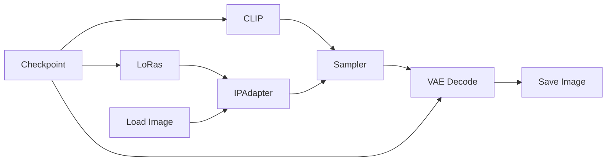

# Guide to ComfyUI - IP-Adapter

*IP-Adapter* is a technique used to guide image generation from one or more reference images. Instead of describing everything only with text, you can provide an image and let the model extract visual information from it. This can be used to transfer style, composition, clothing, character appearance, facial identity, color palette, or general visual mood.

This is different from normal *img2img*. In *img2img*, the input image is the starting point of the generation. The model directly transforms that image. With IP-Adapter, the reference image is not necessarily transformed directly. It is used as guidance. The final image can have a different pose, framing, background, style, or composition, depending on the prompt and the workflow.

This makes IP-Adapter useful when you want reference-based generation without being fully locked to the original image.

Common uses:

- keeping a character visually consistent;
- using a reference for clothing;
- transferring a face or facial identity;
- copying the general style of an image;
- following the composition of a reference;
- guiding the color palette or visual mood;
- combining a text prompt with visual reference control.

However, IP-Adapter is not magic. It does not guarantee perfect consistency by itself. The result still depends on the checkpoint, prompt, weight, preset, denoise behavior, ControlNet, LoRAs, and the quality of the reference image.

## Basic Workflow Diagram

This is the worflow for arbitrary checkpoints. 

## Parameters

### Preset

The `preset` defines what kind of information the IP-Adapter tries to extract from the reference image. Some presets are better for general appearance, some for composition, and some are specialized for faces.

General presets:

| Preset | Main use | Practical note |
|---|---|---|
| `LIGHT` | Subtle reference influence | Good when the reference should only slightly guide the result. |
| `STANDARD` | General-purpose reference | Usually the safest starting point. Try this first before using stronger presets. |
| `VIT-G` | Richer visual reference | Can capture more details, but may also become harder to control. |
| `PLUS` | Stronger reference influence | Useful when `STANDARD` is too weak, but it can start copying the reference too much. |
| `PLUS (kolors general)` | General Kolors usage | Use mainly with Kolors-based workflows. |
| `REGULAR - FLUX and SD3.5 only` | Flux / SD3.5 workflows | Do not use this with normal SDXL or SD1.5 workflows. |
| `COMPOSITION` | Pose, layout, framing, structure | Useful when you care more about the image structure than the character identity or style. |

Face presets:

| Preset | Best for | Practical note |
|---|---|---|
| `PLUS FACE` | General portrait guidance | Good when you want the face to resemble the reference, but not necessarily preserve identity perfectly. |
| `FULL FACE` | Stronger portrait guidance | SD1.5 only. Stronger than `PLUS FACE`, but less flexible. |
| `FACEID` | Facial identity | Better when the goal is to preserve the identity of a person. |
| `FACEID PLUS` | Stronger facial identity | More aggressive than `FACEID`. Can help with consistency, but may reduce freedom. |
| `FACEID PLUS KOLORS` | Face identity with Kolors | Specific variant for Kolors workflows. |
| `FACEID PLUS V2` | Refined facial identity | Usually a better option when available, especially for identity consistency. |
| `FACEID PORTRAIT` | Portrait / style transfer | More focused on portrait appearance and style transfer than pure identity locking. |
| `FACEID PORTRAIT UNNORM` | Strong SDXL portrait transfer | SDXL only. Stronger and less normalized, so it can be powerful but also less predictable. |

A simple rule:

| Goal | Suggested preset |
|---|---|
| General visual reference | `STANDARD` |
| Stronger visual reference | `PLUS` |
| Keep the same face/person | `FACEID`, `FACEID PLUS`, or `FACEID PLUS V2` |
| Transfer pose/layout/composition | `COMPOSITION` |
| Light influence only | `LIGHT` |

### Weight

The `weight` controls how strongly the IP-Adapter pushes the generation toward the reference image. This is one of the most important parameters. A higher value does not simply mean “better consistency”. If the weight is too high, the IP-Adapter may start copying the reference image too literally. 

### Start At

The `start_at` value defines when the IP-Adapter starts influencing the denoising process. Early denoising steps define the large structure of the image: pose, layout, silhouette, camera angle, and general composition. Later steps refine details, textures, colors, and small visual features. Because of that, `start_at` changes the type of influence the reference image has.

| Start At | Effect |
|---|---|
| `0.0` | The reference influences the image from the beginning. Stronger effect on pose, layout, and structure. |
| `0.2` to `0.4` | A balanced range. The base model can establish the scene before the reference becomes stronger. |
| `0.5` to `0.7` | The reference mostly affects appearance, texture, and details. Less structural influence. |
| Very late | The reference may become too weak to meaningfully guide the image. |

The following image was provided to IP-Adapter to influence the given prompt. 

    
    

Below we have a grid of image resulting from the combination of weights (horizontal) and starting points (vertical), using the preset *STANDARD (medium strength)*. In all images, the end point was set to 1, which means the Ip-Adapter influenced the denoising process until the end. Note that the later we allow the IP-Adapter to start influencing the process, the less relevant the weight value becomes.

    

> PS: In this examples we used the checkpoint *Juggernaut XL*, which is a realistic checkpoint.

### End At

The `end_at` value defines when the IP-Adapter stops influencing the denoising process. If `end_at` is set to `1.0`, the IP-Adapter remains active until the end of the generation. This usually preserves the reference more strongly. If it stops earlier, the model has more freedom in the final details.

| End At | Effect |
|---|---|
| `0.5` | The reference stops early. The model has more freedom afterward. |
| `0.7` to `0.9` | Balanced behavior. The reference guides the image but does not dominate until the final step. |
| `1.0` | The reference remains active until the end. Stronger preservation. |

A useful strategy is to control *when* the IP-Adapter acts instead of only changing the weight. For example:

| Problem | Possible adjustment |
|---|---|
| The result copies the reference pose too much | Increase `start_at` |
| The result copies the reference details too much | Decrease `end_at` or lower `weight` |
| The reference is barely visible | Lower `start_at`, increase `end_at`, or increase `weight` |
| The prompt is being ignored | Lower `weight` or shorten the active range |
| The image needs stronger identity preservation | Increase `weight` or keep `end_at` close to `1.0` |

Below we have an example similar to the previous one, except that now we are varying thet ending point. In all images, the starting point was set to 1. Since IP-Adapter exerted influence from the very beginning, note that in extreme cases, even the pose from the original image emerged.

    

## Practical example

Now we will see in practice how to execute an inpainting workflow in ComfyUI. We will use the [IPAdapter.json](https://github.com/felipebottega/AI-Audiovisual-Lab/blob/main/ComfyUI/workflows/IPAdapter.json) file in this tutorial. You can consider it as a canonical file that can be modified gradually according to your needs.

    

This JSON provides the workflow to be used in the ComfyUI interface. It's possible to automate the workflow's execution and change its parameters programmatically; to do this, you must use the API-specific JSON from [this link](https://github.com/felipebottega/AI-Audiovisual-Lab/blob/main/ComfyUI/workflows-api/IPAdapter.json). 

You can use the script [run_workflow.py](https://github.com/felipebottega/AI-Audiovisual-Lab/blob/main/ComfyUI/scripts/run_workflow.py) for this example. If you want to change any parameter, edit the JSON above and then run the scriptwith the command `python run_workflow.py "{path_to_workflow_json}"`.
