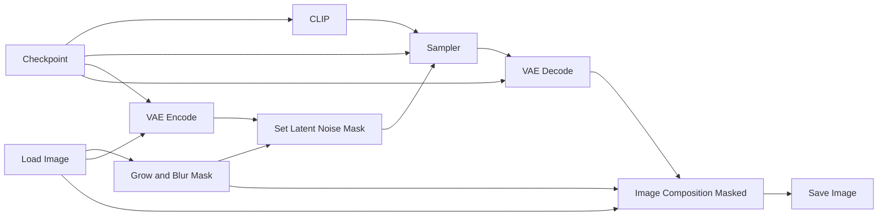

# Guide to ComfyUI - Inpainting

*Inpainting* is a technique used to replace or modify a masked region of an image while keeping the rest mostly unchanged. We will consider two workflows in this tutorial. The first one uses an arbitrary checkpoint to perform the inpainting, whereas the second one uses a diffusion model from the [*Qwen*](https://qwen.ai/home) ecosystem specifically trained for inpainting. 

In theory, any checkpoint can be used for inpainting. This makes the workflow simpler, but it also requires more trial and error until you find a good result. Most of this tutorial will be explained with this workflow in mind. At the end, we will see that the Qwen workflow only requires a few modifications.

## Basic Workflow Diagram

This is the worflow for arbitrary checkpoints. 



## Grow and Blur Mask

This node adjusts the mask before the inpainting step. This is useful because the original mask is often too sharp or too tight around the region to be edited. Expanding and blurring the mask helps the model blend the new content with the surrounding pixels.

* **Expand:** increases or decreases the size of the mask. Positive values make the masked region larger, which gives the model more space to modify the image around the object. This is useful to avoid hard borders or visible leftovers from the original image.
* **Blur Radius:** softens the edges of the mask. A higher value creates a smoother transition between the edited region and the unchanged part of the image. This helps avoid sharp seams, but too much blur may affect areas that should remain unchanged.

## Image Composite Masked

This node pastes one image over another using a mask. In inpainting workflows, it is used because the model may slightly alter the entire image, not only the masked region. The node composites only the masked area from the generated result onto the original image, preserving the unmasked area exactly as it was.

* **x:** horizontal position where the source image will be pasted onto the destination image. Usually this is set to `0` when both images have the same size.
* **y:** vertical position where the source image will be pasted onto the destination image. Usually this is also set to `0` when both images have the same size.
* **Resize Source:** if enabled, the source image is resized to match the destination image before being composited. This is useful when the images may have different dimensions, but for standard inpainting workflows they usually already have the same size.

## Practical example

Now we will see in practice how to execute an inpainting workflow in ComfyUI. We will use the [inpainting.json](https://github.com/felipebottega/AI-Audiovisual-Lab/blob/main/ComfyUI/workflows/inpainting.json) file in this tutorial. You can consider it as a canonical file that can be modified gradually according to your needs.

<p align="center">
    
</p>

This JSON provides the workflow to be used in the ComfyUI interface. It's possible to automate the workflow's execution and change its parameters programmatically; to do this, you must use the API-specific JSON from [this link](https://github.com/felipebottega/AI-Audiovisual-Lab/blob/main/ComfyUI/workflows-api/inpainting.json). 

You can use the script [run_workflow.py](https://github.com/felipebottega/AI-Audiovisual-Lab/blob/main/ComfyUI/scripts/run_workflow.py) for this example. If you want to change any parameter, edit the JSON above and then run the scriptwith the command `python run_workflow.py "{path_to_workflow_json}"`.

For this example we use this image below. Our goal is to have the monster (Eddie, from Iron Maiden) hold a basketball.

<p align="center">
    
</p>

First select the image in the *Load Image* node, right click on it and select *Open in Mask Editor | Image Canvas*. This will open an image editor as we can see below.

<table align="center">
  <tr>
    <td style="padding-right: 30px;">
      
    </td>
    <td>
      
    </td>
  </tr>
</table>

Click on the *Color Selector* to choose a color and the select the icon  to start painting over the image. The idea is to give the model an idea of what you want. This is just a sketch. You can use as many colors and details as you want, but for this example we just used one color and a single shape for simplicity. 

<p align="center">
    
</p>

Once you have finished painting, select the icon  to apply the mask. You should apply exactly over the area you painted the colors, which is the area you want to inpaint. When you click save, the file is saved to `ComfyUI\input\clipspace`, so you can reuse it later.

The final result is shown below.

<p align="center">
    
</p>

Inpainting with normal checkpoints is not easy, you test several values for CFG, denoise, sampler, scheduler, expand and blur radius. In some tests I had good results with CFG as high as 16, so don't be shy to try extreme values. I also recommend using the grid script for inpainting for testing, this will accelerate your search for good parameters.

For inpainting, keep the prompt short and focused on the masked region. Describe only the object or change you want to generate, plus a few important visual details such as color, material, shape, or lighting. Avoid long prompts describing the entire image, since ComfyUI may lose quality or become confused with very large prompts. The prompt should guide what happens inside the mask, while the workflow should preserve the rest of the image.

> PS: Painting colors is not mandatory, one can just paint the mask and run the program.

## Qwen Inpainting Workflow

This workflow uses the Qwen model together with the *InstantX Inpainting ControlNet* to edit only a selected region of an input image. The basic idea is simple: we load an image, paint a mask over the region that should be changed, and let the model regenerate only that masked area according to the prompt. The unmasked area is kept from the original image by compositing the generated result back over the input image.

> PS: Use the file [inpainting.json](https://github.com/felipebottega/AI-Audiovisual-Lab/blob/main/ComfyUI/workflows/image_qwen_image_instantx_inpainting_controlnet.json) for the interactive workflow and [this one](https://github.com/felipebottega/AI-Audiovisual-Lab/blob/main/ComfyUI/workflows-api/image_qwen_image_instantx_inpainting_controlnet.json) for the API workflow.

The procedure is the same as before, except that this workflow uses only 4 steps in the sampler. This is because we are using the 4-step LoRA `Qwen-Image-Lightning-4steps-V1.0`.

This workflow is not just a generic checkpoint adapted for inpainting. Most of its models were trained specifically for this task. Because of that, the workflow is heavier and takes more time to run, but it can produce much better results in difficult cases. Even so, this does not mean that it will always be better. There are situations where the simpler approach works better, especially when the edit is small or the generic checkpoint already understands the object well. There is no universal rule: test both workflows and experiment with different parameters.

## Tips

### Iterate over the result

Inpainting is often an iterative process. Do not expect the perfect result in a single generation. A good strategy is to obtain a reasonable first result, save it, load it again in the inpainting workflow, and then improve smaller details step by step. For example, you can first generate the general object or shape, and then run inpainting again to fix borders, shadows, hands, texture, or small artifacts.

This process can also include switching between workflows. Sometimes the normal checkpoint workflow gives a better first approximation, while the Qwen workflow is better for refining the result. In other cases, the opposite happens. You can use one workflow to create the main edit and another one to polish the details.

### Use a mask larger than the object

The mask should usually be slightly larger than the exact region you want to change. If the mask is too tight, the model may not have enough space to blend the new content with the surrounding image. This can create hard borders, leftovers from the original object, or unnatural transitions.

For objects that interact with the environment, such as a hand holding a ball or a person sitting on a sofa, include some surrounding pixels in the mask. The model may need to modify contact regions, shadows, folds, or nearby contours.

### Adjust denoise according to the size of the change

Low denoise values preserve more of the original image, but they may leave visible traces of the old object. High denoise values allow stronger changes, but they also make the result less predictable. If the edit is small, start with moderate denoise. If you want to replace the masked content with something very different, you may need higher denoise.

A common problem is using a denoise value that is too low for a large semantic change. In this case, the model understands the prompt but cannot fully remove the original content.

### Keep the prompt focused

For inpainting, the prompt should focus on what must appear inside the masked region. Avoid describing the whole image again unless it is necessary. The model already receives the image as context, so a long prompt may confuse the edit.

A good prompt usually describes the new object, its position, material, color, and how it should blend with the image. For example, instead of writing a long description of the entire scene, write something like:

```text
a realistic orange basketball held by the hand, matching the original lighting and perspective
```

### Use visual guidance when the model is confused

Sometimes a mask and a prompt are not enough. If the model does not understand the shape, position, or scale of the object, paint a rough guide before applying the mask. The drawing does not need to be beautiful. A simple colored sketch can be enough to tell the model where the new object should be and how large it should be.

This is especially useful when inserting objects, changing poses, or creating contact between two elements, such as a hand holding an object.

### Do not rely on one seed

Inpainting is unstable. Two seeds with the same parameters may produce very different results. If the setup is almost working, test several seeds before changing the entire workflow. Sometimes the correct configuration is already there, but the current seed is bad.

### Preserve the original image with compositing

Even if the workflow is supposed to edit only the masked region, the generated image may contain small changes outside the mask. The *Image Composite Masked* node is useful because it pastes only the masked region from the generated image back onto the original image. This helps preserve the unmasked area exactly as it was.
