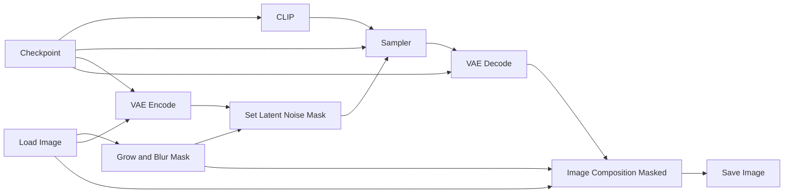

# Guide to ComfyUI - Inpainting

*Inpainting* is a technique used to replace or modify a masked region of an image while keeping the rest mostly unchanged. We will consider two workflows in this tutorial. The first one uses an arbitrary checkpoint to perform the inpainting, whereas the second one uses a diffusion model from the *Qwen* ecosystem specifically trained for inpainting. 

In theory, any checkpoint can be used for inpainting. This makes the workflow simpler, but it also requires more trial and error until you find a good result. Most of this tutorial will be explained with this workflow in mind. At the end, we will see that the Qwen workflow only requires a few modifications.

## Basic Workflow Diagram

This is the worflow for arbitrary checkpoints. 

## Grow and Blur Mask

This node adjusts the mask before the inpainting step. This is useful because the original mask is often too sharp or too tight around the region to be edited. Expanding and blurring the mask helps the model blend the new content with the surrounding pixels.

* **Expand:** increases or decreases the size of the mask. Positive values make the masked region larger, which gives the model more space to modify the image around the object. This is useful to avoid hard borders or visible leftovers from the original image.
* **Blur Radius:** softens the edges of the mask. A higher value creates a smoother transition between the edited region and the unchanged part of the image. This helps avoid sharp seams, but too much blur may affect areas that should remain unchanged.

## Image Composite Masked

This node pastes one image over another using a mask. In inpainting workflows, it is used because the model may slightly alter the entire image, not only the masked region. The node composites only the masked area from the generated result onto the original image, preserving the unmasked area exactly as it was.

* **x:** horizontal position where the source image will be pasted onto the destination image. Usually this is set to `0` when both images have the same size.
* **y:** vertical position where the source image will be pasted onto the destination image. Usually this is also set to `0` when both images have the same size.
* **Resize Source:** if enabled, the source image is resized to match the destination image before being composited. This is useful when the images may have different dimensions, but for standard inpainting workflows they usually already have the same size.

## Practical example

Now we will see in practice how to execute an I2I workflow in ComfyUI. We will use the [img2img_canon.json](https://github.com/felipebottega/AI-Audiovisual-Lab/blob/main/ComfyUI/workflows/img2img_canon.json) file in this tutorial. You can consider it as a canonical I2I file that can be modified gradually according to your needs.

    

This JSON provides the workflow to be used in the ComfyUI interface. It's possible to automate the workflow's execution and change its parameters programmatically; to do this, you must use the API-specific JSON from [this link](https://github.com/felipebottega/AI-Audiovisual-Lab/blob/main/ComfyUI/workflows-api/img2img_canon.json). 

You can use the script [run_workflow.py](https://github.com/felipebottega/AI-Audiovisual-Lab/blob/main/ComfyUI/scripts/run_workflow.py) for this example. If you want to change any parameter, edit the JSON above and then run the scriptwith the command `python run_workflow.py "{path_to_workflow_json}"`.

The workflow file also includes some optional post-processing nodes: upscale and downscale, quantize. These nodes come right after VAE decode and before Save Image. I've already configured these optional nodes for the current example workflow. 

> This example uses the checkpoint called `pixelArtDiffusionXL_spriteShaper`, which creates pixel art style images. It's always necessary to divide the size of the generated image by 8 (with the *Image Resize* node) so that each pixel (simulated) has the correct size. The quantize node is used to limit the number of colors in the palette, which is also useful for pixel art.

    

