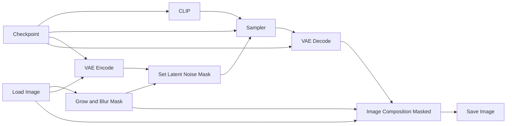

# Guide to ComfyUI - Inpainting

*Inpainting* is a technique used to replace or modify a masked region of an image while keeping the rest mostly unchanged. We will consider two workflows in this tutorial. The first one uses an arbitrary checkpoint to perform the inpainting, whereas the second one uses a diffusion model from the *Qwen* ecosystem specifically trained for inpainting. 

In theory, any checkpoint can be used for inpainting. This makes the workflow simpler, but it also requires more trial and error until you find a good result. Most of this tutorial will be explained with this workflow in mind. At the end, we will see that the Qwen workflow only requires a few modifications.

## Basic Workflow Diagram

This is the worflow for arbitrary checkpoints. 

## Grow and Blur Mask

This node adjusts the mask before the inpainting step. This is useful because the original mask is often too sharp or too tight around the region to be edited. Expanding and blurring the mask helps the model blend the new content with the surrounding pixels.

* **Expand:** increases or decreases the size of the mask. Positive values make the masked region larger, which gives the model more space to modify the image around the object. This is useful to avoid hard borders or visible leftovers from the original image.
* **Blur Radius:** softens the edges of the mask. A higher value creates a smoother transition between the edited region and the unchanged part of the image. This helps avoid sharp seams, but too much blur may affect areas that should remain unchanged.

## Image Composite Masked

This node pastes one image over another using a mask. In inpainting workflows, it is used because the model may slightly alter the entire image, not only the masked region. The node composites only the masked area from the generated result onto the original image, preserving the unmasked area exactly as it was.

* **x:** horizontal position where the source image will be pasted onto the destination image. Usually this is set to `0` when both images have the same size.
* **y:** vertical position where the source image will be pasted onto the destination image. Usually this is also set to `0` when both images have the same size.
* **Resize Source:** if enabled, the source image is resized to match the destination image before being composited. This is useful when the images may have different dimensions, but for standard inpainting workflows they usually already have the same size.

## Practical example

Now we will see in practice how to execute an inpainting workflow in ComfyUI. We will use the [inpainting.json](https://github.com/felipebottega/AI-Audiovisual-Lab/blob/main/ComfyUI/workflows/inpainting.json) file in this tutorial. You can consider it as a canonical file that can be modified gradually according to your needs.

    

This JSON provides the workflow to be used in the ComfyUI interface. It's possible to automate the workflow's execution and change its parameters programmatically; to do this, you must use the API-specific JSON from [this link](https://github.com/felipebottega/AI-Audiovisual-Lab/blob/main/ComfyUI/workflows-api/inpainting.json). 

You can use the script [run_workflow.py](https://github.com/felipebottega/AI-Audiovisual-Lab/blob/main/ComfyUI/scripts/run_workflow.py) for this example. If you want to change any parameter, edit the JSON above and then run the scriptwith the command `python run_workflow.py "{path_to_workflow_json}"`.

For this example we use this image below. Our goal is to have the monster (Eddie, from Iron Maiden) hold a basketball.

    

First select the image in the *Load Image* node, right click on it and select *Open in Mask Editor | Image Canvas*. This will open an image editor as we can see below.

<table align="center">
  <tr>
    <td style="padding-right: 30px;">
      
    </td>
    <td>
      
    </td>
  </tr>
</table>

Click on the *Color Selector* to choose a color and the select the icon  to start painting over the image. The idea is to give the model an idea of what you want. This is just a sketch. You can use as many colors and details as you want, but for this example we just used one color and a single shape for simplicity. 

    

Once you have finished painting, select the icon  to apply the mask. You should apply exactly over the area you painted the colors, which is the area you want to inpaint.

Inpainting with normal checkpoints is not easy, you test several values for CFG, denoise, sampler, scheduler, expand and blur radius. In some tests I had good results with CFG as high as 16, so don't be shy to try extreme values. I also recommend using the grid script for inpainting for testing, this will accelerate your search for good parameters.

## Qwen

