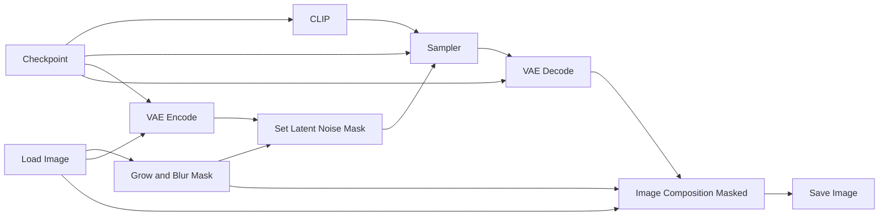

# Guide to ComfyUI - Inpainting

*Inpainting* is a technique used to replace or modify a masked region of an image while keeping the rest mostly unchanged. We will consider two workflows in this tutorial. The first one uses an arbitrary checkpoint to perform the inpainting, whereas the second one uses a diffusion model from the *Qwen* ecosystem specifically trained for inpainting. 

In theory, any checkpoint can be used for inpainting. This makes the workflow simpler, but it also requires more trial and error until you find a good result. Most of this tutorial will be explained with this workflow in mind. At the end, we will see that the Qwen workflow only requires a few modifications.

## Basic Workflow Diagram

This is the worflow for arbitrary checkpoints. 

## Required files

You only need a checkpoint file with the template. Optionally, you can have the LoRA files to apply. There are several templates and LoRAs available [here](https://civitai.com/), it will depend on your objective. 

## LoRAs

LoRAs (Low-Rank Adaptations) are small, specialized files used to modify or fine-tune a base checkpoint's behavior without altering the entire original model. In text-to-image (and text-to-video) workflows, they allow you to inject specific art styles, characters, poses, or structural concepts into your generation.

In ComfyUI, LoRAs are injected directly between the Checkpoint and the Sampler nodes. You can layer multiple LoRAs together, adjusting the strength of each individually to blend different styles or elements.

## Sampler

The Sampler is the core engine that removes random noise step-by-step to form the final image or video, guided by your prompt and settings. Key parameters in ComfyUI include:

* **Steps:** The number of denoising iterations. Standard models require 20–30 steps, while *Lightning* workflows need only 4–8 steps.
* **CFG Scale:** How strictly the model follows your prompt. Higher values force compliance but can cause artifacts, fast-sampling workflows typically use low values (1.0–2.0).
* **Sampler & Scheduler:** The mathematical algorithms used to denoise.
* **Denoise:** Controls how much of the input latent is replaced with noise (0-1), determining how strongly the model can modify the original image.

## Practical example

Now we will see in practice how to execute an I2I workflow in ComfyUI. We will use the [img2img_canon.json](https://github.com/felipebottega/AI-Audiovisual-Lab/blob/main/ComfyUI/workflows/img2img_canon.json) file in this tutorial. You can consider it as a canonical I2I file that can be modified gradually according to your needs.

    

This JSON provides the workflow to be used in the ComfyUI interface. It's possible to automate the workflow's execution and change its parameters programmatically; to do this, you must use the API-specific JSON from [this link](https://github.com/felipebottega/AI-Audiovisual-Lab/blob/main/ComfyUI/workflows-api/img2img_canon.json). 

You can use the script [run_workflow.py](https://github.com/felipebottega/AI-Audiovisual-Lab/blob/main/ComfyUI/scripts/run_workflow.py) for this example. If you want to change any parameter, edit the JSON above and then run the scriptwith the command `python run_workflow.py "{path_to_workflow_json}"`.

The workflow file also includes some optional post-processing nodes: upscale and downscale, quantize. These nodes come right after VAE decode and before Save Image. I've already configured these optional nodes for the current example workflow. 

> This example uses the checkpoint called `pixelArtDiffusionXL_spriteShaper`, which creates pixel art style images. It's always necessary to divide the size of the generated image by 8 (with the *Image Resize* node) so that each pixel (simulated) has the correct size. The quantize node is used to limit the number of colors in the palette, which is also useful for pixel art.

    

