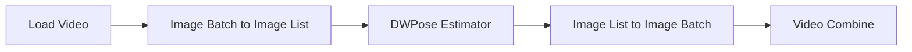

# Guide to ComfyUI - Pose Video

## Introduction to ControlNet

*ControlNet* is a method for guiding image generation with additional visual information. Instead of relying only on the text prompt, it allows the diffusion model to follow a structural reference such as a pose map, depth map, edge image, segmentation mask, line drawing, etc.

In this tutorial, ControlNet is used with an OpenPose image. The pose map defines the position of the body, limbs, hands, and face, while the checkpoint and text prompt determine the character, clothing, style, lighting, and background. In other words, ControlNet controls the composition and structure without replacing the normal generation process.

## Basic Workflow Diagram



This workflow converts the source video into an MP4 pose-control video. Each frame contains the detected OpenPose skeleton instead of the original image. The resulting file can then be loaded as the ControlNet input of a vid2vid workflow.

## Parameters

### Load Video

The **Load Video** node reads the input video and converts it into a sequence of images. Each video frame becomes one image that can be processed by the following nodes.

- **Video:** Selects the video file that will be loaded. The uploaded file is stored in the ComfyUI input directory and becomes available in the node's video selector.
- **Force Rate:** Changes the frame rate used when extracting the video frames.
    - **`0`:** Preserves the original frame rate.
    - **A value greater than `0`:** Resamples the video to the selected frame rate by discarding or duplicating frames.
- **Custom Width:** Defines the width of the extracted frames.
    - **`0`:** Preserves the original width unless the selected format preset changes it.
    - **A value greater than `0`:** Resizes the frames to the specified width.
- **Custom Height:**  Defines the height of the extracted frames.
    - **`0`:** Preserves the original height unless the selected format preset changes it.
    - **A value greater than `0`:** Resizes the frames to the specified height.
- **Frame Load Cap:** Limits the maximum number of frames loaded from the video.
    - **`0`:** Loads all available frames.
    - **A value greater than `0`:** Loads at most the specified number of frames.
- **Skip First Frames:** Skips a number of frames from the beginning of the loaded sequence. For example, a value of `30` skips the first 30 frames after the optional frame-rate conversion has been applied. This parameter can be combined with `frame_load_cap` to divide a long video into smaller sections.
- **Select Every Nth:** Controls the interval between selected frames.
    - **`1`:** Loads every frame.
    - **`2`:** Loads every second frame.
    - **`3`:** Loads every third frame.
- **Format:** Applies loading recommendations and compatibility rules for a specific video model.
    - **`None`:** Does not apply a model-specific preset.
    - **`Wan`:** Uses settings designed for Wan workflows, including a suggested frame rate of 16 FPS, dimensions divisible by 8, and a frame count compatible with the $4n+1$ structure used by Wan video models.

> PS: For a standalone pose-extraction workflow, the format preset is not strictly required. However, selecting `Wan` is useful when the pose video will later be passed directly into a Wan vid2vid or control-video workflow. The preset can truncate a few frames from the end when the loaded frame count does not match the required structure.

### Image Batch to Image List

Converts a batch of video frames into a list so each frame can be processed individually.

### DWPose Estimator

The **DWPose Estimator** converts a regular image into an OpenPose-style pose map. It first detects each person in the image and then estimates the body, hand, and facial keypoints.

<p align="center">
    
</p>

- **Detect Hand:** Controls whether hand and finger keypoints are included.
- **Detect Body:** Controls whether the main body skeleton is detected.
- **Detect Face:** Controls whether facial landmarks are included in the pose map. Facial landmarks do not preserve identity and should not be treated as a detailed expression reference.
- **Resolution:** Defines the resolution used by the preprocessor when analyzing the input image. Increasing the resolution cannot recover details that are not visible in the original image.
- **BBox Detector:** The bounding-box detector finds each person before the pose estimator analyzes them.
    - **`yolox_l.onnx`:** A reliable general-purpose detector with good accuracy. It works well with multiple people and is usually fast when ONNX GPU acceleration is available.
    - **`yolox_l.torchscript.pt`:** The TorchScript version of YOLOX-L. It runs through PyTorch and is useful when ONNX acceleration is unavailable, misconfigured, or running on the CPU.
    - **`yolo_nas_l_fp16.onnx`:** The largest YOLO-NAS option. It is heavier and slower, but can help with difficult scenes containing small, partially hidden, or overlapping people.
    - **`yolo_nas_m_fp16.onnx`:** The medium YOLO-NAS option. It provides a balance between speed and detection capability.
    - **`yolo_nas_s_fp16.onnx`:** The smallest and fastest YOLO-NAS option. It is suitable for a clearly visible person but may be less reliable with small or obstructed subjects.
    - **`None`:** Disables the dedicated person detector. This may work for an image already cropped around one person, but it is generally less reliable for full scenes or multiple subjects.
- **Pose Estimator:** After the bounding-box detector finds a person, the pose estimator locates the body, hand, foot, and facial keypoints.
    - **`dw-ll_ucoco_384.onnx`:** The higher-resolution ONNX estimator. It usually provides the best quality for body, face, hands, and feet, especially when ONNX GPU acceleration is working correctly.
    - **`dw-ll_ucoco_384_bs5.torchscript.pt`:** The TorchScript version of the higher-resolution estimator. It runs through PyTorch and is a good alternative when ONNX is unavailable or not using the GPU correctly.
    - **`dw-ll_ucoco.onnx`:** A lower-resolution variant. It is faster and uses less memory, but may be less accurate for hands, feet, faces, and small people.
- **Scale Stick for Xinsir ControlNet:** Controls how the detected skeleton is rendered in the final pose image. This parameter does not change the detected pose or the physical thickness of the generated character. It only changes how the skeleton is drawn.
    - **`enable`:** Adjusts the line thickness and keypoint size to better match the pose-map format expected by Xinsir OpenPose ControlNet models.
    - **`disable`:** Uses the standard OpenPose line and keypoint sizes.

### Recommended Quality Configuration

```text
detect_hand: enable
detect_body: enable
detect_face: enable
resolution: 1024
bbox_detector: yolox_l.onnx
pose_estimator: dw-ll_ucoco_384.onnx
scale_stick_for_xinsr_cn: enable
```

### Image List to Image Batch

Combines the processed frame list back into a batch so it can be encoded as a video.

## Practical example

We will use the [vid2pose.json](https://github.com/felipebottega/AI-Audiovisual-Lab/blob/main/ComfyUI/workflows/vid2pose.json) file in this tutorial. It converts a video into a video of its poses. The corresponding API JSON file can be found [here](https://github.com/felipebottega/AI-Audiovisual-Lab/blob/main/ComfyUI/workflows-api/vid2pose.json).

<p align="center">
    
</p>

You can use the script [run_workflow.py](https://github.com/felipebottega/AI-Audiovisual-Lab/blob/main/ComfyUI/scripts/run_workflow.py) for this example. If you want to change any parameter, edit the JSON above and then run the script with the command `python run_workflow.py "{path_to_workflow_json}"`.
