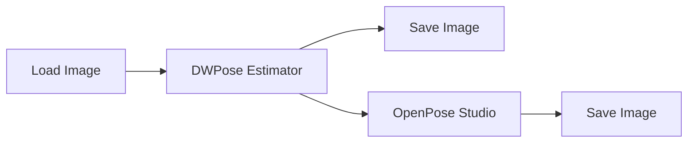
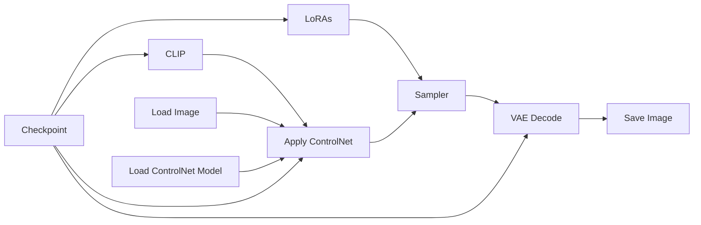
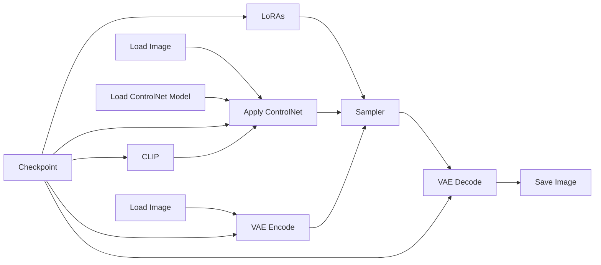

# Guide to ComfyUI - Pose

## Introduction to ControlNet

*ControlNet* is a method for guiding image generation with additional visual information. Instead of relying only on the text prompt, it allows the diffusion model to follow a structural reference such as a pose map, depth map, edge image, segmentation mask, line drawing, etc.

In this tutorial, ControlNet is used with an OpenPose image. The pose map defines the position of the body, limbs, hands, and face, while the checkpoint and text prompt determine the character, clothing, style, lighting, and background. In other words, ControlNet controls the composition and structure without replacing the normal generation process.

## Basic Workflow Diagram

Below is the diagram for creating the pose. The *OpenPose Studio* branch is optional, it is only useful if you want to edit the pose before saving. We will discuss this further later on.



This will create the pose, which is just a PNG file. After that you need to insert it in a ControlNet node of a txt2img or img2img workflow. We show both workflows below.

### OpenPose with txt2img workflow

Use OpenPose with txt2img when the pose should be the main structural reference and no initial image needs to be preserved. The pose map controls the body position, while the prompt, checkpoint, LoRAs, and reference tools determine the character, clothing, style, and background. This is usually the cleanest option for creating a new image in a specific pose.



### OpenPose with img2img worflow

Use OpenPose with **img2img** when you also want to retain visual information from an existing image.

* **Source-pose reinforcement:** Extract the pose map from the same image used as the **img2img** input. Both inputs then describe the same body structure, so OpenPose stabilizes the pose and reduces anatomical drift during restyling, refinement, or higher-denoise regeneration.
* **Pose replacement:** Use a different pose map to redraw the subject in a new pose. This requires higher denoise so the original body structure can be removed and replaced, at the cost of preserving fewer source-image details.
* **Pose-guided inpainting:** Mask the original person and enough surrounding space for the new body position, then use OpenPose to guide the reconstruction while keeping the unmasked background unchanged.

Low denoise preserves the original image more strongly. High denoise gives the new pose more control.



## Required files

When working with OpenPose, the ControlNet model used should be compatible with the checkpoint in the workflow. In this case we are using the [diffusion_pytorch_model](https://huggingface.co/xinsir/controlnet-openpose-sdxl-1.0/blob/main/diffusion_pytorch_model.safetensors) OpenPose model for it is the one compatible with the Pony Diffusion V6 XL checkpoint. All ControlNet models should be downloaded and placed in the folder `ComfyUI/models/controlnet`.

<p align="center">
    
</p>

## Parameters

The **DWPose Estimator** converts a regular image into an OpenPose-style pose map. It first detects each person in the image and then estimates the body, hand, and facial keypoints.

<p align="center">
    
</p>

### Detect Hand

Controls whether hand and finger keypoints are included.

### Detect Body

Controls whether the main body skeleton is detected.

### Detect Face

Controls whether facial landmarks are included in the pose map. Facial landmarks do not preserve identity and should not be treated as a detailed expression reference.

### Resolution

Defines the resolution used by the preprocessor when analyzing the input image. Increasing the resolution cannot recover details that are not visible in the original image.

### BBox Detector

The bounding-box detector finds each person before the pose estimator analyzes them.

- **`yolox_l.onnx`:** A reliable general-purpose detector with good accuracy. It works well with multiple people and is usually fast when ONNX GPU acceleration is available.
- **`yolox_l.torchscript.pt`:** The TorchScript version of YOLOX-L. It runs through PyTorch and is useful when ONNX acceleration is unavailable, misconfigured, or running on the CPU.
- **`yolo_nas_l_fp16.onnx`:** The largest YOLO-NAS option. It is heavier and slower, but can help with difficult scenes containing small, partially hidden, or overlapping people.
- **`yolo_nas_m_fp16.onnx`:** The medium YOLO-NAS option. It provides a balance between speed and detection capability.
- **`yolo_nas_s_fp16.onnx`:** The smallest and fastest YOLO-NAS option. It is suitable for a clearly visible person but may be less reliable with small or obstructed subjects.
- **`None`:** Disables the dedicated person detector. This may work for an image already cropped around one person, but it is generally less reliable for full scenes or multiple subjects.

### Pose Estimator

After the bounding-box detector finds a person, the pose estimator locates the body, hand, foot, and facial keypoints.

- **`dw-ll_ucoco_384.onnx`:** The higher-resolution ONNX estimator. It usually provides the best quality for body, face, hands, and feet, especially when ONNX GPU acceleration is working correctly.
- **`dw-ll_ucoco_384_bs5.torchscript.pt`:** The TorchScript version of the higher-resolution estimator. It runs through PyTorch and is a good alternative when ONNX is unavailable or not using the GPU correctly.
- **`dw-ll_ucoco.onnx`:** A lower-resolution variant. It is faster and uses less memory, but may be less accurate for hands, feet, faces, and small people.

### Scale Stick for Xinsir ControlNet

Controls how the detected skeleton is rendered in the final pose image.

- **`enable`:** Adjusts the line thickness and keypoint size to better match the pose-map format expected by Xinsir OpenPose ControlNet models.
- **`disable`:** Uses the standard OpenPose line and keypoint sizes.

This parameter does not change the detected pose or the physical thickness of the generated character. It only changes how the skeleton is drawn.

## Recommended Quality Configuration

```text
detect_hand: enable
detect_body: enable
detect_face: enable
resolution: 1024
bbox_detector: yolox_l.onnx
pose_estimator: dw-ll_ucoco_384.onnx
scale_stick_for_xinsr_cn: enable
```

## Practical example

Now we will see in practice how to execute an T2I workflow in ComfyUI. We will use the [txt2img_canon.json](https://github.com/felipebottega/AI-Audiovisual-Lab/blob/main/ComfyUI/workflows/txt2img_canon.json) file in this tutorial. You can consider it as a canonical T2I file that can be modified gradually according to your needs.

<p align="center">
    
</p>

This JSON provides the workflow to be used in the ComfyUI interface. It's possible to automate the workflow's execution and change its parameters programmatically; to do this, you must use the API-specific JSON from [this link](https://github.com/felipebottega/AI-Audiovisual-Lab/blob/main/ComfyUI/workflows-api/txt2img_canon.json). Below, we show the beginning and end of this JSON, just to give an idea of ​​how it is structured.

```
{
  "3": {
    "inputs": {
      "seed": 566510339945522,
      "steps": 20,
      "cfg": 5,
      "sampler_name": "euler",
      "scheduler": "normal",
      "denoise": 1,
      "model": [
        "11",
        0
      ],
      "positive": [
        "6",
        0
      ],
      "negative": [
        "7",
        0
      ],
      "latent_image": [
        "5",
        0
      ]
    },
    "class_type": "KSampler",
    "_meta": {
      "title": "KSampler"
    }
  },
 
  ...

"13": {
    "inputs": {
      "filename_prefix": "ComfyUI",
      "images": [
        "8",
        0
      ]
    },
    "class_type": "SaveImage",
    "_meta": {
      "title": "Save Image"
    }
  }
}
```

You can use the script [run_workflow.py](https://github.com/felipebottega/AI-Audiovisual-Lab/blob/main/ComfyUI/scripts/run_workflow.py) for this example. If you want to change any parameter, edit the JSON above and then run the scriptwith the command `python run_workflow.py "{path_to_workflow_json}"`.

The workflow file also includes some optional post-processing nodes: upscale and downscale, quantize. These nodes come right after VAE decode and before Save Image. I've already configured these optional nodes for the current example workflow. 

> This example uses the checkpoint called `pixelArtDiffusionXL_spriteShaper`, which creates pixel art style images. It's always necessary to divide the size of the generated image by 8 (with the *Image Resize* node) so that each pixel (simulated) has the correct size. The quantize node is used to limit the number of colors in the palette, which is also useful for pixel art.

<p align="center">
    
</p>
