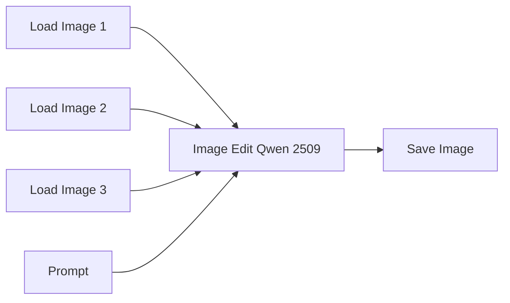

# Guide to ComfyUI - Qwen Image Edit

[*Qwen Image Edit*](https://qwen.ai/blog?id=qwen-image-edit) is an image editing model from the Qwen ecosystem designed to modify an existing image using natural language instructions. Instead of generating an image completely from scratch, it uses the input image as the main reference and applies the requested changes while trying to preserve the original composition, style, lighting, and visual coherence.

It can be used for tasks such as inpainting, object replacement, style changes, pose adjustments, background edits, outpainting-like expansions, and general image transformation. One of its strengths is that it can understand visual context very well, so it often works with simple prompts and can follow drawn guides, masks, or marked regions in the image.

However, Qwen Image Edit is not always perfectly literal. For precise edits, it is important to clearly describe what must change and what must stay the same. The prompt should usually define the input image as the source of truth and explicitly ask the model to preserve identity, pose, composition, lighting, outfit, background, or any other important element.

> PS: In this tutorial we will be working with *Qwen Image Edit 2509*. This number refers to the model release version, following a year-month style convention. Here, `25` means 2025 and `09` means September.

## Basic Workflow Diagram

This is the worflow for arbitrary checkpoints. 



The node `Image Edit Qwen 2509` is wrapper for a more complex subgraph of nodes. It is possible to access this subgraph by clicking on the expand icon on the upper right corner of the node. We will not discuss what is happening in this subgraph and will simply accept that it is working correctly.

<p align="center">
    
    
</p>

## Practical examples

Now we will see in practice how to execute an inpainting workflow in ComfyUI. We will use the [IPAdapter.json](https://github.com/felipebottega/AI-Audiovisual-Lab/blob/main/ComfyUI/workflows/qwen_image_edit_one_image.json) file in this tutorial. You can consider it as a canonical file that can be modified gradually according to your needs.

<p align="center">
    
</p>

This JSON provides the workflow to be used in the ComfyUI interface. It's possible to automate the workflow's execution and change its parameters programmatically; to do this, you must use the API-specific JSON from [this link](https://github.com/felipebottega/AI-Audiovisual-Lab/blob/main/ComfyUI/workflows-api/qwen_image_edit_one_image.json). 

You can use the script [run_workflow.py](https://github.com/felipebottega/AI-Audiovisual-Lab/blob/main/ComfyUI/scripts/run_workflow.py) for this example. If you want to change any parameter, edit the JSON above and then run the scriptwith the command `python run_workflow.py "{path_to_workflow_json}"`.

The links above leads to the workflow with a single reference image, but Qwen Image Edit can actually work with up to three reference images. To access the other links, replace `one_image` with `two_images` or `three_images`.

Since this workflow offers many possibilities, it is worthwhile to demonstrate some practical examples of its application.

### Example 1 - Removal

In this example, you provide an image and ask the model to remove an element from it. Notice that this prompt is different from the prompts used in regular text-to-image generation. Usually, you describe the scene directly or provide a list of tags that describe what you want to generate. Qwen Image Edit works differently, it uses the input image as the visual reference and follows natural language instructions to modify it.

However, this does not mean that you are having a conversation with the model. The prompt should still be written as a clear set of instructions, explaining what should change and what should stay the same. Finding the right prompt is not always obvious, and small changes in wording can have a significant impact on the final result.

<p align="center">
    
    
</p>

Sometimes, you can achieve the desired result with a simple prompt, like the one in this example. Always start simple and only expand the prompt if necessary.

### Example 2 - Change characters

Qwen Image Edit accepts up to three input images. However, you need to be more careful when writing the prompt, as the model lacks any internal indexing to determine which image you are referring to.

<p align="center">
    
</p>

### Example 3 - Actions

You can change the position or pose, or even have the characters perform specific actions. Basically, you can tell them to do anything, just like real actors.

It is important to note that the output can vary significantly depending on the seed. Sometimes an attempt turns out terrible, while the next one looks beautiful. You cannot conclude that a prompt is bad based on just a few attempts; generate plenty of images before drawing conclusions.

<p align="center">
    
</p>

### Example 4 - Change specifics

Just as it is possible to modify characters, you can also alter objects, clothing, styles, and more. 

It is important to keep in mind that, while powerful, Qwen Image Edit is not a complete substitute for inpainting or IP-Adapter. Depending on the context, using a specific checkpoint with simple inpainting might be more effective than trying to handle everything through prompt engineering within this workflow.

<p align="center">
    
</p>

### Example 5 - Remove specifics

In the previous example, the character retained the pose from the reference image used for the outfit. Not only that, but the background also changed. While this could have been resolved by further refining the prompt, we left it as is.

The real issue is that the brand name appeared at the bottom of the image. You can simply ask the model to remove it.

<p align="center">
    
</p>

We can take this generated image and go a step further: modify multiple objects in the scene at once.

<p align="center">
    
</p>

> PS: Notice how the image became increasingly reddish as more changes were made. This sort of thing can happen with AI image generation, the output gradually diverges in certain areas. Controlling this is entirely up to the user. Don't expect the AI ​​to be a magic box that always gets everything perfect.

### Example 6 - Angle change

You can also ask the model to redraw your object or character from a new angle. It is capable of recreating unseen parts and inferring what the view would look like from a different perspective.

<p align="center">
    
</p>

Now we ask something more difficult of the model: to change the viewpoint of an entire scene instead of just a character. In this case, it was necessary to create a more elaborate prompt.

<p align="center">
    
</p>

### Example 7 - Multiple changes

In this example, we shift the point of view and introduce a character positioned in a specific way within this new setting.

<p align="center">
    
</p>

### Example 8 - Change scenario

It is also possible to take a photo of a person and another photo of a setting, and ask the model to place that person in that setting.

<p align="center">
    
</p>

### Example 9 - Text

Changing text is also possible, just ask the model.

<p align="center">
    
</p>

### Example 10 - Visual guides

In the [inpainting tutorial](https://github.com/felipebottega/AI-Audiovisual-Lab/blob/main/ComfyUI/Guide-ComfyUI-Inpainting.md), we saw how to draw on the image to guide the model during the inpainting process. This is also possible with Qwen Image Edit, but in an even more versatile way. You aren't limited to simply drawing a sketch of the object you want to appear there, you can place markers and instruct the model to draw something over them, sketch a stick figure to guide a pose, or even use text to guide the model.

<p align="center">
    
</p>

## Tips

Qwen-Image-Edit is not a traditional text-to-image model. The input image already provides most of the visual content, while the prompt describes how that content should be changed.

The model processes the source image through two complementary paths:

* a vision-language encoder for semantic understanding
* a VAE encoder for visual appearance and reconstruction

A useful way to think about an edit prompt is:

```text
Operation + Target + Change + Preservation rules + Final result
```

For example:

```text
Replace the woman's blue jacket with a dark-red leather jacket.
Preserve her face, hairstyle, pose, body proportions, background, lighting, and camera angle.
The final image must contain only the original woman.
```

### 1. Write Instructions, Not Stable Diffusion Tags

Qwen-Image-Edit generally responds better to direct natural-language instructions than to a list of disconnected tags.

#### Prefer

```text
Remove the wooden chair beside the table and reconstruct the floor behind it.
```

#### Avoid

```text
chair removal, empty floor, clean background, high quality, detailed
```

Begin the prompt with a clear action verb:

* `Add`
* `Remove`
* `Replace`
* `Move`
* `Change`
* `Extend`
* `Reconstruct`
* `Convert`
* `Redraw`

The official examples and prompt enhancer use direct instructions such as “Turn this cat into a dog” and “Replace Y with X.” ([Hugging Face][5])

### 2. Identify the Target Precisely

Do not assume that the model will infer which object you mean when several similar objects are present.

#### Weak

```text
Remove the tree.
```

### Better

```text
Remove the small tree immediately behind the farmhouse on the right side of the image.
```

Useful target descriptors include:

* object type
* color
* clothing
* relative position
* nearby objects
* orientation
* size

For example:

```text
Change the expression of the woman wearing the white shirt on the left. Keep the man on the right unchanged.
```

### 3. Describe the Final Visual State

Focus on what the finished image should contain, not only on the operation being performed.

#### Weak

```text
Remove the boy.
```

#### Better

```text
Remove the boy completely and reconstruct the wall, floor, and furniture that were hidden behind him. The final image must contain only the woman.
```

This is especially important when removing large subjects. Without a reconstruction instruction, the model may leave:

* blurry areas
* duplicated body parts
* remnants of the removed object
* empty patches
* unrelated replacement objects

### 4. State What Must Be Preserved

Preservation instructions are useful when an edit should affect only part of the image.

```text
Preserve the original person's face, hairstyle, expression, pose, body proportions, clothing, background, lighting, and camera angle.
```

However, preserve only the properties that actually matter.

#### Avoid excessive repetition

```text
Keep everything exactly the same. Do not change anything. Preserve everything. The image must remain identical.
```

This can conflict with the requested edit and encourage the model to make almost no change.

#### Better

```text
Change only the jacket. Preserve the face, hair, pose, hands, body proportions, background, and lighting.
```

### 5. Separate the Source Role from the Requested Transformation

For complex edits, explicitly explain how the input image should be used.

```text
Use the input image as the source of truth for the character's identity, face, hairstyle, clothing colors, and art style.
```

For a radical layout transformation:

```text
Use the input image only as the visual source for the object designs and art style. Do not preserve its original composition or spatial arrangement.
```

This distinction is crucial. Without it, the model may assume that the original layout must remain intact.

### 6. Use Positive Instructions Before Negative Restrictions

First explain what the model should create. Then add a small number of restrictions addressing likely failure modes.

#### Good structure

```text
Redraw the existing woman sitting cross-legged on top of the table.
Preserve her identity, face, hairstyle, clothing, and the original room.
Do not add another woman. Do not leave the original woman in her previous position.
```

#### Avoid long negative keyword lists

```text
no duplicate, no extra person, no wrong pose, no deformed hands, no bad anatomy, no blur, no artifacts...
```

The official Qwen pipeline commonly uses an empty negative prompt, so important exclusions should be expressed as understandable instructions in the main edit prompt. ([Hugging Face][5])

### 7. Use the Minimum Sufficient Detail

A good prompt is not necessarily a long prompt.

The official enhancer is explicitly instructed to add only the minimum details needed to make the edit clear and visually feasible. ([GitHub][3])

#### Simple edit

```text
Replace the red cup on the table with a transparent glass of water. Preserve the rest of the image.
```

#### Complex edit

A longer prompt is justified when the task involves:

* several independent objects
* major layout changes
* multiple reference images
* pose reconstruction
* background reconstruction
* modular asset generation

Length should come from necessary constraints, not from repeating the same idea.

### 8. Prefer One Main Transformation per Generation

A prompt such as this is technically understandable:

```text
Change her pose, replace her clothes, move the camera, alter the weather, remove the furniture, and convert the image into watercolor.
```

However, every additional transformation creates another opportunity for inconsistency.

A more reliable sequence would be:

1. change the camera or composition
2. correct the subject placement
3. replace the clothing
4. adjust the expression
5. apply the final style

This also makes failures easier to diagnose.

### 9. Prevent Subject Duplication

When moving or replacing a person, explicitly state that the original instance must not remain.

```text
Move the existing woman onto the table. This is the same woman, not an additional person. Remove her from her original position. The final image must contain exactly two people.
```

For replacement:

```text
Replace the original person with the reference person. Do not add the reference person beside the original.
```

Words such as `add` can encourage duplication. Use `move`, `replace`, or `redraw the existing subject` when the subject count should remain unchanged.

### 10. Describe Poses Anatomically

Avoid relying only on short pose names.

#### Weak

```text
Make her sit like Buddha.
```

#### Better

```text
Redraw the existing woman sitting cross-legged on the table. Her hips rest on the tabletop, both knees point outward, her lower legs cross in front of her body, her torso remains upright, and both hands rest naturally on her knees.
```

Describe:

* torso orientation
* head direction
* arm placement
* hand placement
* hip position
* leg placement
* contact with surrounding surfaces

Also state which properties should not be copied from a pose reference:

```text
Follow the body arrangement from the pose guide, but preserve the original character's face, clothing, proportions, and art style.
```

### 11. Use Visual Marks as Temporary Instructions

Qwen-Image-Edit-2509 supports visual conditions such as sketches, edges, depth maps, and keypoints. ([Hugging Face][5])

When drawing a box, cross, silhouette, or guide over the source image, explain both its purpose and its temporary nature.

```text
The green rectangle is only a placement guide. Place the existing character entirely inside this area at the indicated scale. Remove the green rectangle completely from the final image.
```

For a pose drawing:

```text
The red body outline is only a pose and placement guide. Follow its head, torso, arm, and leg positions. Do not copy its red color or line style. Remove every red guide mark from the final image.
```

### 12. Prompting Multi-Image Edits

Qwen-Image-Edit-2509 supports one to three input images, with the model card reporting its best performance in that range. ([Hugging Face][5])

Do not rely only on `Image 1`, `Image 2`, and `Image 3`. Also describe each image by its visual role.

```text
Use the bedroom image as the base scene.

Use the close-up portrait only as the identity reference for the woman.

Use the clothing photograph only as the reference for the new outfit.
```

Then define the final hierarchy:

```text
The final composition, room, camera angle, and pose must come from the bedroom image. Only the woman's facial identity comes from the portrait. Only the jacket design comes from the clothing reference.
```

### 13. Text Editing

Place the exact text inside quotation marks.

```text
Replace the sign text "OPEN" with "CLOSED". Preserve the original sign position, font style, letter size, material, perspective, and lighting.
```

Do not write:

```text
Change OPEN to CLOSED somehow.
```

The official enhancer explicitly requires text content to be placed in double quotation marks and recommends specifying visual properties only when needed. ([GitHub][3])

### 14. Inpainting and Outpainting

For inpainting, describe both the editable area and the expected reconstruction.

```text
Perform inpainting on the masked area. Remove the person and reconstruct the wooden floor, wall, and furniture that would naturally continue behind them.
```

For outpainting:

```text
Extend the image beyond its boundaries using outpainting. Continue the same room, floor, walls, lighting, perspective, and art style. Reveal the full bed and the complete bodies of both people.
```

The official prompt enhancer uses explicit inpainting and outpainting formulations rather than treating them as ordinary object additions. ([GitHub][3])

### 15. Local Edits and Global Transformations Need Different Language

#### Local edit

A local edit preserves nearly all of the original composition.

```text
Replace the flower in the girl's hair with the pink flower design shown in the reference. Place it exactly over the green cross. Preserve the girl and the rest of the image.
```

#### Global transformation

A global transformation must explicitly release the original layout.

```text
Replace the entire original composition with a new organized asset sheet. Preserve the visual designs and art style of the objects, but discard all original positions, groupings, roads, enclosures, and spatial relationships.
```

Using local-edit language for a global transformation often causes the model to preserve too much.

### 16. Handling Large Composition Changes

When the desired result is structurally different from the source, clarify four things:

1. what the source supplies
2. what must be discarded
3. what must be reconstructed
4. how the new result must be organized

Template:

```text
Use the input image only as the source for [visual properties].

Discard the original [layout, composition, grouping, or perspective].

Redraw [objects or subjects] as [new form].

Arrange the final result as [specific output structure].
```

Example:

```text
Use the input image only as the source for the farm objects, cartoon art style, colors, outlines, and elevated top-down perspective.

Discard the original farm-map layout, roads, paddocks, and object positions.

Redraw the reusable objects as complete isolated game assets, reconstructing any hidden parts.

Arrange the final result as a clean environment asset sheet on a pure white background.
```

### 17. Scene-to-Asset-Sheet Tasks

Do not ask the model merely to “extract the elements.” That wording may encourage it to copy large portions of the original scene.

Prefer:

```text
Redraw each unique reusable object as a complete independent game asset.
```

Continuous structures should be explicitly decomposed.

```text
Convert the continuous fences into separate straight sections, corner sections, end posts, curved sections, and gate pieces.

Convert the connected road into separate straight paths, curves, intersections, and end pieces.
```

Also distinguish valid assets from scene regions:

```text
The complete paddocks and enclosed map areas are not assets. Do not preserve them as large shapes.
```

### 18. Turbo Mode and Prompt Evaluation

#### Standard mode

```text
Lightning LoRA: disabled
Steps: 20
CFG: 4.0
```

#### Turbo mode

```text
Lightning LoRA: enabled
Steps: 4
CFG: 1.0
```

The Lightning LoRA is designed to reduce the process to four steps. ([ComfyUI][1])

Turbo mode is useful for fast experimentation, but difficult edits should be validated in standard mode. Do not conclude that a prompt is ineffective based only on a four-step result.

[1]: https://docs.comfy.org/tutorials/image/qwen/qwen-image-edit "Qwen-Image-Edit ComfyUI Native Workflow Example - ComfyUI"
[2]: https://github.com/QwenLM/Qwen-Image "GitHub - QwenLM/Qwen-Image: Qwen-Image is a powerful image generation foundation model capable of complex text rendering and precise image editing. · GitHub"
[3]: https://github.com/QwenLM/Qwen-Image/blob/main/src/examples/tools/prompt_utils.py "Qwen-Image/src/examples/tools/prompt_utils.py at main · QwenLM/Qwen-Image · GitHub"
[4]: https://arxiv.org/abs/2508.02324?utm_source=chatgpt.com "Qwen-Image Technical Report"
[5]: https://huggingface.co/Qwen/Qwen-Image-Edit-2509 "Qwen/Qwen-Image-Edit-2509 · Hugging Face"
