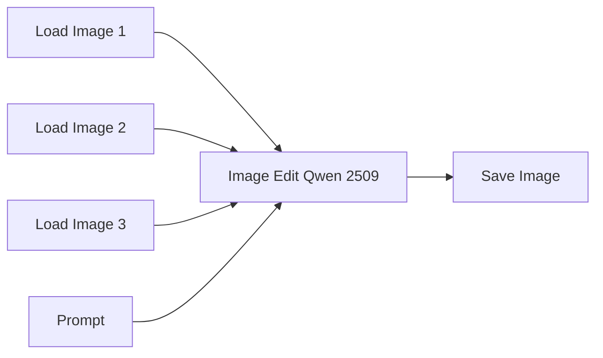

# Guide to ComfyUI - Qwen Image Edit

[*Qwen Image Edit*](https://qwen.ai/blog?id=qwen-image-edit) is an image editing model from the Qwen ecosystem designed to modify an existing image using natural language instructions. Instead of generating an image completely from scratch, it uses the input image as the main reference and applies the requested changes while trying to preserve the original composition, style, lighting, and visual coherence.

It can be used for tasks such as inpainting, object replacement, style changes, pose adjustments, background edits, outpainting-like expansions, and general image transformation. One of its strengths is that it can understand visual context very well, so it often works with simple prompts and can follow drawn guides, masks, or marked regions in the image.

However, Qwen Image Edit is not always perfectly literal. For precise edits, it is important to clearly describe what must change and what must stay the same. The prompt should usually define the input image as the source of truth and explicitly ask the model to preserve identity, pose, composition, lighting, outfit, background, or any other important element.

> PS: In this tutorial we will be working with *Qwen Image Edit 2509*. This number refers to the model release version, following a year-month style convention. Here, `25` means 2025 and `09` means September.

## Basic Workflow Diagram

This is the worflow for arbitrary checkpoints. 

The node `Image Edit Qwen 2509` is wrapper for a more complex subgraph of nodes. It is possible to access this subgraph by clicking on the expand icon on the upper right corner of the node. We will not discuss what is happening in this subgraph and will simply accept that it is working correctly.

    
    

## Practical example

Now we will see in practice how to execute an inpainting workflow in ComfyUI. We will use the [IPAdapter.json](https://github.com/felipebottega/AI-Audiovisual-Lab/blob/main/ComfyUI/workflows/qwen_image_edit.json) file in this tutorial. You can consider it as a canonical file that can be modified gradually according to your needs.

    

This JSON provides the workflow to be used in the ComfyUI interface. It's possible to automate the workflow's execution and change its parameters programmatically; to do this, you must use the API-specific JSON from [this link](https://github.com/felipebottega/AI-Audiovisual-Lab/blob/main/ComfyUI/workflows-api/qwen_image_edit.json). 

You can use the script [run_workflow.py](https://github.com/felipebottega/AI-Audiovisual-Lab/blob/main/ComfyUI/scripts/run_workflow.py) for this example. If you want to change any parameter, edit the JSON above and then run the scriptwith the command `python run_workflow.py "{path_to_workflow_json}"`.
