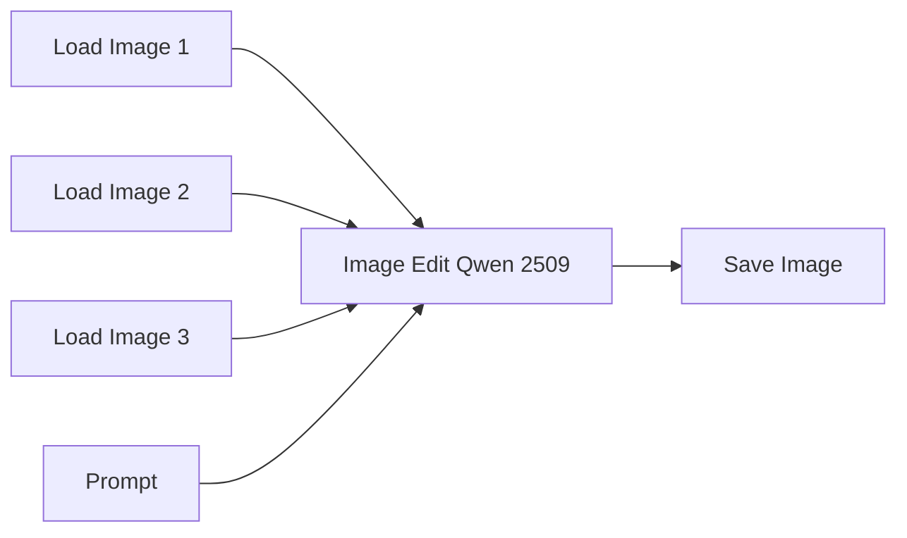

# Guide to ComfyUI - Qwen Image Edit

[*Qwen Image Edit*](https://qwen.ai/blog?id=qwen-image-edit) is an image editing model from the Qwen ecosystem designed to modify an existing image using natural language instructions. Instead of generating an image completely from scratch, it uses the input image as the main reference and applies the requested changes while trying to preserve the original composition, style, lighting, and visual coherence.

It can be used for tasks such as inpainting, object replacement, style changes, pose adjustments, background edits, outpainting-like expansions, and general image transformation. One of its strengths is that it can understand visual context very well, so it often works with simple prompts and can follow drawn guides, masks, or marked regions in the image.

However, Qwen Image Edit is not always perfectly literal. For precise edits, it is important to clearly describe what must change and what must stay the same. The prompt should usually define the input image as the source of truth and explicitly ask the model to preserve identity, pose, composition, lighting, outfit, background, or any other important element.

> PS: In this tutorial we will be working with *Qwen Image Edit 2509*. This number refers to the model release version, following a year-month style convention. Here, `25` means 2025 and `09` means September.

## Basic Workflow Diagram

This is the worflow for arbitrary checkpoints. 

The node `Image Edit Qwen 2509` is wrapper for a more complex subgraph of nodes. It is possible to access this subgraph by clicking on the expand icon on the upper right corner of the node. We will not discuss what is happening in this subgraph and will simply accept that it is working correctly.

    
    

## Practical examples

Now we will see in practice how to execute an inpainting workflow in ComfyUI. We will use the [IPAdapter.json](https://github.com/felipebottega/AI-Audiovisual-Lab/blob/main/ComfyUI/workflows/qwen_image_edit.json) file in this tutorial. You can consider it as a canonical file that can be modified gradually according to your needs.

    

This JSON provides the workflow to be used in the ComfyUI interface. It's possible to automate the workflow's execution and change its parameters programmatically; to do this, you must use the API-specific JSON from [this link](https://github.com/felipebottega/AI-Audiovisual-Lab/blob/main/ComfyUI/workflows-api/qwen_image_edit.json). 

You can use the script [run_workflow.py](https://github.com/felipebottega/AI-Audiovisual-Lab/blob/main/ComfyUI/scripts/run_workflow.py) for this example. If you want to change any parameter, edit the JSON above and then run the scriptwith the command `python run_workflow.py "{path_to_workflow_json}"`.

Since this workflow offers many possibilities, it is worthwhile to demonstrate some practical examples of its application.

### Example 1 - Removal

In this example, you provide an image and ask the model to remove an element from it. Notice that this prompt is different from the prompts used in regular text-to-image generation. Usually, you describe the scene directly or provide a list of tags that describe what you want to generate. Qwen Image Edit works differently, it uses the input image as the visual reference and follows natural language instructions to modify it.

However, this does not mean that you are having a conversation with the model. The prompt should still be written as a clear set of instructions, explaining what should change and what should stay the same. Finding the right prompt is not always obvious, and small changes in wording can have a significant impact on the final result.

    
    

Sometimes, you can achieve the desired result with a simple prompt, like the one in this example. Always start simple and only expand the prompt if necessary.

### Example 2 - Change characters

Qwen Image Edit accepts up to three input images. However, you need to be more careful when writing the prompt, as the model lacks any internal indexing to determine which image you are referring to.

    

### Example 3 - Actions

You can change the position or pose, or even have the characters perform specific actions. Basically, you can tell them to do anything, just like real actors.

It is important to note that the output can vary significantly depending on the seed. Sometimes an attempt turns out terrible, while the next one looks beautiful. You cannot conclude that a prompt is bad based on just a few attempts; generate plenty of images before drawing conclusions.

    

### Example 4 - Change specifics

Just as it is possible to modify characters, you can also alter objects, clothing, styles, and more. 

It is important to keep in mind that, while powerful, Qwen Image Edit is not a complete substitute for inpainting or IP-Adapter. Depending on the context, using a specific checkpoint with simple inpainting might be more effective than trying to handle everything through prompt engineering within this workflow.

    

### Example 5 - Remove specifics

In the previous example, the character retained the pose from the reference image used for the outfit. Not only that, but the background also changed. While this could have been resolved by further refining the prompt, we left it as is.

The real issue is that the brand name appeared at the bottom of the image. You can simply ask the model to remove it.

    

We can take this generated image and go a step further: modify multiple objects in the scene at once.

    

> PS: Notice how the image became increasingly reddish as more changes were made. This sort of thing can happen with AI image generation, the output gradually diverges in certain areas. Controlling this is entirely up to the user. Don't expect the AI ​​to be a magic box that always gets everything perfect.

### Example 6 - Angle change

You can also ask the model to redraw your object or character from a new angle. It is capable of recreating unseen parts and inferring what the view would look like from a different perspective.

    

Now we ask something more difficult of the model: to change the viewpoint of an entire scene instead of just a character. In this case, it was necessary to create a more elaborate prompt.

    

### Example 7 - Multiple changes

In this example, we shift the point of view and introduce a character positioned in a specific way within this new setting.

    

### Example 8 - Change scenario

It is also possible to take a photo of a person and another photo of a setting, and ask the model to place that person in that setting.

    

