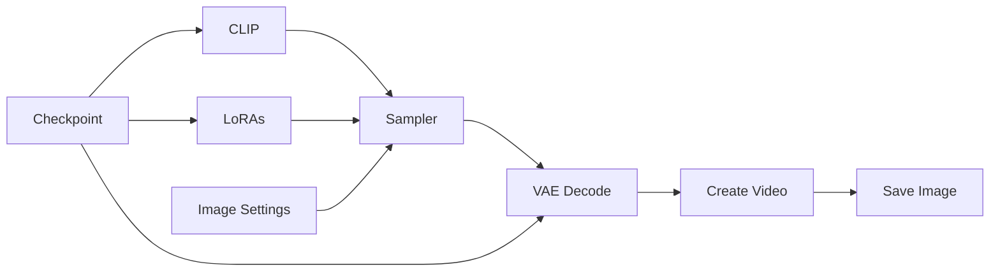

# Guide to ComfyUI - Text to Image (T2I)

## Basic Workflow Diagram

Although WAN 2.2 internally uses separate high-noise and low-noise stages, most ComfyUI workflows expose these stages as distinct nodes and checkpoints. The image and prompt are first converted into conditioning information, then the generation process is split into two phases. The outputs of these stages are combined to produce the final video. In Lightning workflows, specialized LoRAs are often applied to both stages, allowing the model to generate high-quality results with very few sampling steps.



## Required files

You only need a checkpoint file with the template. Optionally, you can have the LoRA files to apply. There are several templates and LoRAs available [here](https://civitai.com/), it will depend on your objective. 

## LoRAs

LoRAs (Low-Rank Adaptations) are small, specialized files used to modify or fine-tune a base checkpoint's behavior without altering the entire original model. In text-to-image (and text-to-video) workflows, they allow you to inject specific art styles, characters, poses, or structural concepts into your generation.

In ComfyUI, LoRAs are injected directly between the Checkpoint and the Sampler nodes. You can layer multiple LoRAs together, adjusting the strength of each individually to blend different styles or elements.

## ModelSamplingSD3 (Shift)

`ModelSamplingSD3` is a ComfyUI node used to adjust how the model behaves during sampling.

### What the shift does

The **shift** value modifies the noise schedule used during the diffusion process. In practice, it changes how the sampler traverses the denoising trajectory between pure noise and the final image or video. 

Because the model was trained with a specific noise distribution, changing the shift alters how closely inference follows that training distribution. Depending on the model, this can affect:

- stability
- style
- motion character
- overall generation feel

> PS: Different models are often trained with different expected shift values, so using the recommended setting is usually important for achieving the intended results.

### Where to place it

It should usually come **after** the model modifications and **before** the sampler:

```text
UNetLoader  → LoRA → ModelSamplingSD3 → KSampler
```

### Practical advice

- Use the default or near-default value first.
- Increase the shift only if you understand how it changes the output.
- Too much shift can make results feel less stable or less faithful to the prompt/image.

## KSampler (Advanced)

WAN 2.2 workflows often split sampling across **two KSampler (Advanced)** nodes:

- one for **high noise**
- one for **low noise**

### High-noise KSampler

This sampler is responsible for the first part of the denoising process. Its role is to:

- inject or manage noise
- create the initial movement structure
- establish the rough visual plan

### Low-noise KSampler

This sampler continues the generation after the structure is already established. Its role is to:

- refine the latent
- sharpen details
- improve coherence
- stabilize the final look

### Why split the process in two?

Splitting the process lets you control the generation more precisely.

It also matches the internal logic of WAN 2.2:

- the first stage is for broad structure
- the second stage is for refinement

This is why many workflows pair WAN 2.2 with two samplers rather than one.

## Resources and Associated Files on CivitAI

WAN 2.2 files are commonly found through official sources and community mirrors such as [CivitAI](https://civitai.com/). In practice, many users do not download everything manually. ComfyUI templates can often fetch the needed components automatically through **Browse Templates**.

Typical resources include:

- WAN 2.2 **High Noise** checkpoint
- WAN 2.2 **Low Noise** checkpoint
- **UMT5** text encoder
- **VAE** files
- community **LoRAs**
- ready-made **ComfyUI workflows**

### Why this matters

This is helpful because WAN 2.2 workflows often break when one file is missing or mismatched.  
Having the correct set of files avoids:

- model loading errors
- incompatible LoRA behavior
- broken prompt encoding
- poor video quality caused by wrong VAE selection

### Practical file organization

A common structure is:

```text
ComfyUI/models/
```

For LoRAs:

```text
ComfyUI/models/loras/
```

## Practical example

Now we will see in practice how to execute an I2V workflow with WAN in ComfyUI. We will use the [img2vid_canon.json](https://github.com/felipebottega/AI-Audiovisual-Lab/blob/main/ComfyUI/workflows/img2vid_canon.json) file in this tutorial. You can consider it as a canonical I2V file that can be modified gradually according to your needs.

<p align="center">
    
</p>

There are two LoRAs being used in this workflow, but you can include others if you want.

This JSON provides the workflow to be used in the ComfyUI interface. It's possible to automate the workflow's execution and change its parameters programmatically; to do this, you must use the API-specific JSON from [this link](https://github.com/felipebottega/AI-Audiovisual-Lab/blob/main/ComfyUI/workflows-api/img2vid_canon.json). Below, we show the beginning and end of this JSON, just to give an idea of ​​how it is structured.

```
{
  "84": {
    "inputs": {
      "clip_name": "umt5_xxl_fp8_e4m3fn_scaled.safetensors",
      "type": "wan",
      "device": "default"
    },
    "class_type": "CLIPLoader",
    "_meta": {
      "title": "Load CLIP"
    }
  },
 
  ...

  "126": {
    "inputs": {
      "lora_name": "wan2.2_i2v_lightx2v_4steps_lora_v1_low_noise.safetensors",
      "strength_model": 1.0000000000000002,
      "model": [
        "96",
        0
      ]
    },
    "class_type": "LoraLoaderModelOnly",
    "_meta": {
      "title": "LoraLoaderModelOnly"
    }
  }
}
```

You can use the script [run_workflow.py](https://github.com/felipebottega/AI-Audiovisual-Lab/blob/main/ComfyUI/scripts/run_workflow.py) script with the parameter file [params.json](https://github.com/felipebottega/AI-Audiovisual-Lab/blob/main/ComfyUI/scripts/params.json) for this example. Edit the parameter file and run the command `python run_workflow.py "img2vid_canon.json" "params.json"` in the terminal. The path `path_to_input`  should be the absolute path to the image, while `path_to_output` should be the relative path.

We also make workflow (img2vid_canon_complete.json)[https://github.com/felipebottega/AI-Audiovisual-Lab/blob/main/ComfyUI/workflows/img2vid_canon_complete.json] and its API workflow file [img2vid_canon_complete.json](https://github.com/felipebottega/AI-Audiovisual-Lab/blob/main/ComfyUI/workflows-api/img2vid_canon_complete.json) available for download. The difference is that this one has some optional post-processing nodes: color and brightness node, upscale and downscale, background removal, and saving frames as PNG. These nodes come right after `VAE decode` and before `Create Video`.
