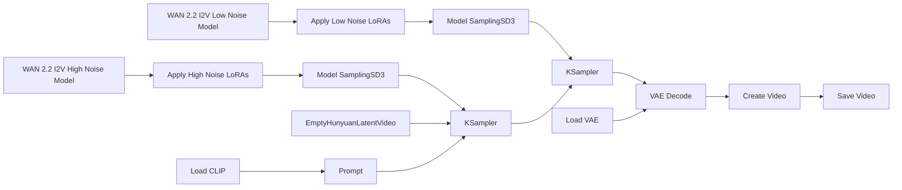

# Guide to ComfyUI - Text to Video (T2V)

## Technical Description of WAN 2.2

**Wan 2.2** is a multimodal diffusion-based video generation model (developed by Wan AI/Alibaba) released as open source. It uses a large **Mixture-of-Experts** (MoE) architecture. In practice, this means the generation process is split into stages specialized for different noise levels:

- **High-noise stage**: builds the global structure, movement, and composition.
- **Low-noise stage**: refines details, consistency, and visual polish.

For T2V, the model turns a text prompt into a video.

## Basic Workflow Diagram

Although WAN 2.2 internally uses separate high-noise and low-noise stages, most ComfyUI workflows expose these stages as distinct nodes and checkpoints. The image and prompt are first converted into conditioning information, then the generation process is split into two phases. The outputs of these stages are combined to produce the final video. In Lightning workflows, specialized LoRAs are often applied to both stages, allowing the model to generate high-quality results with very few sampling steps.



## Required files

For a standard ComfyUI setup, you usually need the following files:

- **`wan2.2_i2v_high_noise_14B_fp8_scaled.safetensors`**  
  The high-noise checkpoint. It is responsible for the first part of the diffusion process, where the model decides motion, composition, and broad structure.

- **`wan2.2_i2v_low_noise_14B_fp8_scaled.safetensors`**  
  The low-noise checkpoint. It refines the video after the main structure is already in place.

- **`wan2.2_i2v_lightx2v_4steps_lora_v1_high_noise.safetensors`**
  The high-noise Lightx2V LoRA. It is applied to the high-noise checkpoint and helps the model achieve good results with fewer sampling steps, reducing generation time while preserving the overall motion and structure.

- **`wan2.2_i2v_lightx2v_4steps_lora_v1_low_noise.safetensors`**
  The low-noise Lightx2V LoRA. It is applied to the low-noise checkpoint and helps maintain visual quality during the refinement stage when using low step counts.

- **`umt5_xxl_fp8_e4m3fn_scaled.safetensors`**  
  The text encoder. It converts the prompt into features the model can use.

- **VAE file**  
  Usually the VAE provided for WAN 2.2 / WAN 2.1-compatible workflows. The VAE is what helps decode the latent representation into an actual image/video output.

- **Optional LoRA files**  
  Used to add style, motion, realism, or other visual behaviors without retraining the full model.

## Low noise vs. high noise

### High-noise stage
This stage comes first and is the most important for:

- initial motion
- camera direction
- scene layout
- large shape placement
- overall energy of the clip

### Low-noise stage
This stage comes after the structure is already defined and is responsible for:

- sharper details
- cleaner textures
- better temporal coherence
- less visual instability
- more polished final frames

## Lightning / LightX2V Workflows

Some WAN 2.2 workflows optionally use LightX2V (Lightning) LoRAs for the high-noise and low-noise stages. These LoRAs are applied on top of the base checkpoints and are designed to **distill the sampling process**, enabling high-quality results with significantly fewer steps. This allows the model to generate videos much faster and with lower computational cost. However, because the sampling process is heavily compressed, results may show **reduced temporal refinement and less stable or detailed motion** compared to standard multi-step workflows. For this reason, Lightning workflows are best suited for fast iteration and previews, while standard workflows remain preferable when maximum quality and motion consistency are the priority.

In the **Lightning** style workflow, it is common to see something like:

- **2 high-noise steps**
- **2 low-noise steps**

This is not arbitrary. It works because Lightning LoRAs are designed to make the model usable with **very few denoising steps**. The practical logic is:

- The **first 2 steps** give enough room to establish motion and composition.
- The **next 2 steps** refine the output without wasting time on unnecessary denoising passes.

So the model does not need many steps because the LoRA is already pushing it toward a fast, compressed generation path.

In a **full, non-Lightning workflow**, the same idea still applies, but the total step count is usually higher.

## LoRAs

With WAN 2.2, LoRAs are often used to:

- add a specific visual style
- increase realism
- improve cinematic behavior
- guide motion
- adapt the model to a niche aesthetic
- compensate for limitations in the base model

### One LoRA file vs. separate high/low versions

This is one of the most important practical points.

#### Case 1: the LoRA is a single file

If the LoRA is delivered as **one file only**, apply the same LoRA to **both** branches:

- high-noise branch
- low-noise branch

This keeps the adaptation present across the full denoising process.

#### Case 2: the LoRA has separate versions

Some LoRAs are built with different strengths or files for:

- high-noise behavior
- low-noise behavior

In that case:

- use the **high-noise LoRA** on the high-noise branch
- use the **low-noise LoRA** on the low-noise branch

### Why the same LoRA may be enough for both branches

If you only connect a LoRA to one stage, the effect may fade or become inconsistent.

Applying the same LoRA to both branches helps because:

- the first stage sets the main direction
- the second stage keeps the same style while refining the result

That is especially useful for:

- style LoRAs
- character consistency
- realistic rendering
- branded aesthetics

### High-noise vs. low-noise LoRA behavior

In practice:

- **motion / action LoRAs** often feel stronger on the **high-noise** stage
- **detail / style LoRAs** often feel stronger on the **low-noise** stage

This is not a strict rule, but it is a good mental model.

### LoRA placement in ComfyUI

Place LoRA nodes **before** the sampler.

Correct flow:

```text
UNetLoader → LoRA → ModelSamplingSD3 → KSampler
```

Incorrect flow:

```text
UNetLoader → KSampler → LoRA
```

The LoRA must influence the model before sampling begins.

### LoRA Strength Settings

There is no universal perfect value. A good starting point is usually **1.0**.

## ModelSamplingSD3 (Shift)

`ModelSamplingSD3` is a ComfyUI node used to adjust how the model behaves during sampling.

### What the shift does

The **shift** value modifies the noise schedule used during the diffusion process. In practice, it changes how the sampler traverses the denoising trajectory between pure noise and the final image or video. 

Because the model was trained with a specific noise distribution, changing the shift alters how closely inference follows that training distribution. Depending on the model, this can affect:

- stability
- style
- motion character
- overall generation feel

> PS: Different models are often trained with different expected shift values, so using the recommended setting is usually important for achieving the intended results.

### Where to place it

It should usually come **after** the model modifications and **before** the sampler:

```text
UNetLoader  → LoRA → ModelSamplingSD3 → KSampler
```

### Practical advice

- Use the default or near-default value first.
- Increase the shift only if you understand how it changes the output.
- Too much shift can make results feel less stable or less faithful to the prompt/image.

## KSampler (Advanced)

WAN 2.2 workflows often split sampling across **two KSampler (Advanced)** nodes:

- one for **high noise**
- one for **low noise**

### High-noise KSampler

This sampler is responsible for the first part of the denoising process. Its role is to:

- inject or manage noise
- create the initial movement structure
- establish the rough visual plan

### Low-noise KSampler

This sampler continues the generation after the structure is already established. Its role is to:

- refine the latent
- sharpen details
- improve coherence
- stabilize the final look

### Why split the process in two?

Splitting the process lets you control the generation more precisely.

It also matches the internal logic of WAN 2.2:

- the first stage is for broad structure
- the second stage is for refinement

This is why many workflows pair WAN 2.2 with two samplers rather than one.

## Resources and Associated Files on CivitAI

WAN 2.2 files are commonly found through official sources and community mirrors such as [CivitAI](https://civitai.com/). In practice, many users do not download everything manually. ComfyUI templates can often fetch the needed components automatically through **Browse Templates**.

Typical resources include:

- WAN 2.2 **High Noise** checkpoint
- WAN 2.2 **Low Noise** checkpoint
- **UMT5** text encoder
- **VAE** files
- community **LoRAs**
- ready-made **ComfyUI workflows**

### Why this matters

This is helpful because WAN 2.2 workflows often break when one file is missing or mismatched.  
Having the correct set of files avoids:

- model loading errors
- incompatible LoRA behavior
- broken prompt encoding
- poor video quality caused by wrong VAE selection

### Practical file organization

A common structure is:

```text
ComfyUI/models/
```

For LoRAs:

```text
ComfyUI/models/loras/
```

## Practical example

Now we will see in practice how to execute an T2V workflow with WAN in ComfyUI. We will use the [txt2vid_canon.json](https://github.com/felipebottega/AI-Audiovisual-Lab/blob/main/ComfyUI/workflows/txt2vid_canon.json) file in this tutorial. You can consider it as a canonical T2V file that can be modified gradually according to your needs.

<p align="center">
    
</p>

This JSON provides the workflow to be used in the ComfyUI interface. It's possible to automate the workflow's execution and change its parameters programmatically, to do this, you must use the API-specific JSON from [this link](https://github.com/felipebottega/AI-Audiovisual-Lab/blob/main/ComfyUI/workflows-api/txt2vid_canon.json). 

You can use the script [run_workflow.py](https://github.com/felipebottega/AI-Audiovisual-Lab/blob/main/ComfyUI/scripts/run_workflow.py) for this example. You can use the script [run_workflow.py](https://github.com/felipebottega/AI-Audiovisual-Lab/blob/main/ComfyUI/scripts/run_workflow.py) for this example. If you want to change any parameter, edit the JSON above and then run the scrip with the command `python run_workflow.py "{path_to_workflow_json}"` in the terminal.

The workflow file also includes some optional post-processing nodes: color and brightness node, upscale and downscale, background removal, and saving frames as PNG. These nodes come right after `VAE decode` and before `Create Video`.

<p align="center">
    
</p>
