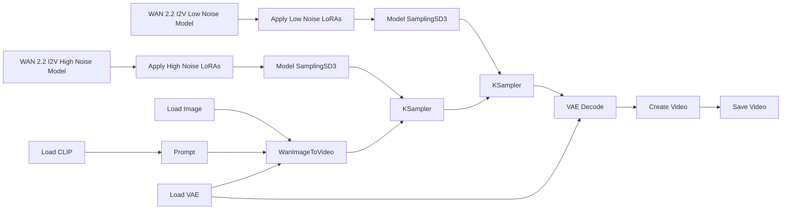

# Guide to ComfyUI - Video to Video (V2V)

## Technical Description of WAN 2.2

**Wan 2.2** is a multimodal diffusion-based video generation model (developed by Wan AI/Alibaba) released as open source. It uses a large **Mixture-of-Experts** (MoE) architecture. In practice, this means the generation process is split into stages specialized for different noise levels:

- **High-noise stage**: builds the global structure, movement, and composition.
- **Low-noise stage**: refines details, consistency, and visual polish.

For I2V, the model turns a still image into a video while trying to preserve the identity, layout, and style of the source image.

## Basic Workflow Diagram

Although WAN 2.2 internally uses separate high-noise and low-noise stages, most ComfyUI workflows expose these stages as distinct nodes and checkpoints. The image and prompt are first converted into conditioning information, then the generation process is split into two phases. The outputs of these stages are combined to produce the final video. In Lightning workflows, specialized LoRAs are often applied to both stages, allowing the model to generate high-quality results with very few sampling steps.

## Required files

For a standard ComfyUI setup, you usually need the following files:

- **`wan2.2_fun_control_high_noise_14B_fp8_scaled.safetensors`**  
  The high-noise diffusion model. It handles the early denoising stage, where the overall composition, motion, body structure, camera behavior, and response to the control video are established.

- **`wan2.2_fun_control_low_noise_14B_fp8_scaled.safetensors`**  
  The low-noise diffusion model. It handles the later refinement stage, improving details, textures, edges, facial features, and temporal consistency after the main structure has already been created.

- **`wan2.2_i2v_lightx2v_4steps_lora_v1_high_noise.safetensors`**
  The high-noise Lightx2V LoRA. It is applied to the high-noise checkpoint and helps the model achieve good results with fewer sampling steps, reducing generation time while preserving the overall motion and structure.

- **`wan2.2_i2v_lightx2v_4steps_lora_v1_low_noise.safetensors`**
  The low-noise Lightx2V LoRA. It is applied to the low-noise checkpoint and helps maintain visual quality during the refinement stage when using low step counts.

- **`umt5_xxl_fp8_e4m3fn_scaled.safetensors`**  
  The text encoder. It converts the prompt into features the model can use.

- **VAE file**  
  Usually the VAE provided for WAN 2.2 / WAN 2.1-compatible workflows. The VAE is what helps decode the latent representation into an actual image/video output.

- **Optional LoRA files**  
  Used to add style, motion, realism, or other visual behaviors without retraining the full model.

> A latent representation is a compressed version of an image or video that preserves its most important visual information. WAN 2.2 performs diffusion in this compressed space for efficiency, and the VAE later converts it back into normal pixels.

## Practical example

Now we will see in practice how to execute an I2V workflow with WAN in ComfyUI. We will use the [vid2vid_canon.json](https://github.com/felipebottega/AI-Audiovisual-Lab/blob/main/ComfyUI/workflows/vid2vid_canon.json) file in this tutorial. You can consider it as a canonical I2V file that can be modified gradually according to your needs.

    

This JSON provides the workflow to be used in the ComfyUI interface. It's possible to automate the workflow's execution and change its parameters programmatically, to do this, you must use the API-specific JSON from [this link](https://github.com/felipebottega/AI-Audiovisual-Lab/blob/main/ComfyUI/workflows-api/vid2vid_canon.json). 

You can use the script [run_workflow.py](https://github.com/felipebottega/AI-Audiovisual-Lab/blob/main/ComfyUI/scripts/run_workflow.py) for this example. If you want to change any parameter, edit the JSON above and then run the scriptwith the command `python run_workflow.py "{path_to_workflow_json}"`.

The workflow file also includes some optional post-processing nodes: color and brightness node, upscale and downscale, background removal, and saving frames as PNG. These nodes come right after `VAE decode` and before `Create Video`.

    

