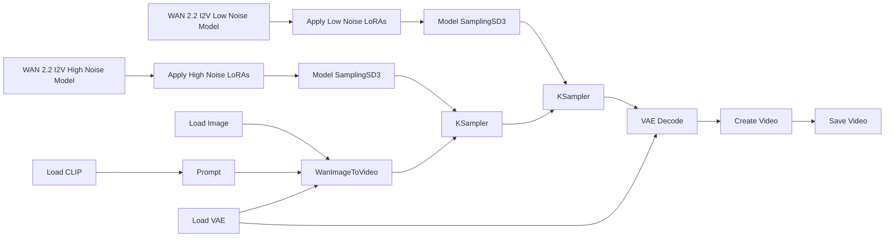

# Guide to using ComfyUI with WAN 2.2 - Image to Video (I2V)

## Technical Description of WAN 2.2

**Wan 2.2** is a multimodal diffusion-based video generation model (developed by Wan AI/Alibaba) released as open source. It uses a large **Mixture-of-Experts** (MoE) architecture. In practice, this means the generation process is split into stages specialized for different noise levels:

- **High-noise stage**: builds the global structure, movement, and composition.
- **Low-noise stage**: refines details, consistency, and visual polish.

For I2V, the model turns a still image into a video while trying to preserve the identity, layout, and style of the source image.

## Basic Workflow Diagram

Although WAN 2.2 internally uses separate high-noise and low-noise stages, most ComfyUI workflows expose these stages as distinct nodes and checkpoints. The image and prompt are first converted into conditioning information, then the generation process is split into two phases. The outputs of these stages are combined to produce the final video. In Lightning workflows, specialized LoRAs are often applied to both stages, allowing the model to generate high-quality results with very few sampling steps.



1. **WAN 2.2 I2V High Noise Model**  
   The model used during the first stage of generation. It operates in the high-noise region of the diffusion process, where the main goal is to establish motion, composition, scene structure, and overall dynamics.

2. **Apply High Noise LoRAs**  
   Applies LoRAs to the high-noise model. These LoRAs modify the model's behavior without changing the base checkpoint and are often used to improve motion, realism, style, or accelerate generation in Lightning workflows.

3. **Model SamplingSD3**  
   Configures the model for the sampling process. In practice, it prepares the checkpoint so that the sampler can perform the denoising steps correctly.

4. **KSampler (High Noise Stage)**  
   Executes the denoising steps for the high-noise stage. This phase establishes the overall structure of the video, including movement, camera direction, and large-scale visual features.

5. **WAN 2.2 I2V Low Noise Model**  
   The model used during the second stage of generation. It focuses on refining information that was established during the high-noise stage rather than creating new structure.

6. **Apply Low Noise LoRAs**  
   Applies LoRAs to the low-noise model. These LoRAs typically enhance refinement, detail quality, texture consistency, and overall visual polish.

7. **Model SamplingSD3**  
   Performs the same role as in the high-noise branch, preparing the low-noise model for the denoising process.

8. **KSampler (Low Noise Stage)**  
   Executes the denoising steps for the low-noise stage. This phase refines details, improves temporal consistency, and produces a cleaner final result.

9. **Load Image**  
   Loads the source image that serves as the starting point for Image-to-Video generation. The model uses this image as a reference for appearance, composition, and subject identity.

10. **WanImageToVideo**  
    The central node that prepares the Image-to-Video conditioning. It combines information from the source image, text prompt, CLIP encoder, and VAE to create the inputs required by the diffusion process.

11. **Load CLIP**  
    Loads the text encoder used to interpret prompts. The encoded text is converted into conditioning information that guides the video generation process.

12. **Prompt**  
    The text description that guides the generation. Prompts can influence content, actions, camera movement, style, atmosphere, and other visual characteristics.

13. **Load VAE**  
    Loads the Variational Autoencoder (VAE), which is responsible for converting between pixel space and latent space. Diffusion takes place in latent space because it is significantly more efficient.

14. **VAE Decode**  
    Converts the final latent representation into visible video frames. This is the stage where the compressed internal representation becomes actual images.

15. **Create Video**  
    Combines the decoded frames into a continuous video sequence using the selected frame rate and encoding settings.

16. **Save Video**  
    Exports the completed video file to disk, making the generated result available for viewing or further processing.

## Required files

For a standard ComfyUI setup, you usually need the following files:

- **`wan2.2_i2v_high_noise_14B_fp8_scaled.safetensors`**  
  The high-noise checkpoint. It is responsible for the first part of the diffusion process, where the model decides motion, composition, and broad structure.

- **`wan2.2_i2v_low_noise_14B_fp8_scaled.safetensors`**  
  The low-noise checkpoint. It refines the video after the main structure is already in place.

- **`umt5_xxl_fp8_e4m3fn_scaled.safetensors`**  
  The text encoder. It converts the prompt into features the model can use.

- **VAE file**  
  Usually the VAE provided for WAN 2.2 / WAN 2.1-compatible workflows. The VAE is what helps decode the latent representation into an actual image/video output.

- **Optional LoRA files**  
  Used to add style, motion, realism, or other visual behaviors without retraining the full model.

> A latent representation is a compressed version of an image or video that preserves its most important visual information. WAN 2.2 performs diffusion in this compressed space for efficiency, and the VAE later converts it back into normal pixels.

## Low noise vs. high noise

### High-noise stage
This stage comes first and is the most important for:

- initial motion
- camera direction
- scene layout
- large shape placement
- overall energy of the clip

### Low-noise stage
This stage comes after the structure is already defined and is responsible for:

- sharper details
- cleaner textures
- better temporal coherence
- less visual instability
- more polished final frames

## Lightning / LightX2V Workflows

Some WAN 2.2 workflows optionally use LightX2V (Lightning) LoRAs for the high-noise and low-noise stages. These LoRAs are applied on top of the base checkpoints and are designed to **distill the sampling process**, enabling high-quality results with significantly fewer steps. This allows the model to generate videos much faster and with lower computational cost. However, because the sampling process is heavily compressed, results may show **reduced temporal refinement and less stable or detailed motion** compared to standard multi-step workflows. For this reason, Lightning workflows are best suited for fast iteration and previews, while standard workflows remain preferable when maximum quality and motion consistency are the priority.

In the **Lightning** style workflow, it is common to see something like:

- **2 high-noise steps**
- **2 low-noise steps**

This is not arbitrary. It works because Lightning LoRAs are designed to make the model usable with **very few denoising steps**. The practical logic is:

- The **first 2 steps** give enough room to establish motion and composition.
- The **next 2 steps** refine the output without wasting time on unnecessary denoising passes.

So the model does not need many steps because the LoRA is already pushing it toward a fast, compressed generation path.

In a **full, non-Lightning workflow**, the same idea still applies, but the total step count is usually higher.

## LoRAs

### What is a LoRA?

A **LoRA** (Low-Rank Adaptation) is a lightweight model add-on used to modify behavior without retraining the whole model.

With WAN 2.2, LoRAs are often used to:

- add a specific visual style
- increase realism
- improve cinematic behavior
- guide motion
- adapt the model to a niche aesthetic
- compensate for limitations in the base model

### Why LoRAs matter with WAN 2.2

WAN is not trained as an NSFW-focused model.  
Because of that, many users rely on LoRAs to push the output toward specific styles or domains.

That said, the main point is broader than NSFW alone:

- the base model gives you a general foundation
- the LoRA gives you a specialized behavior layer

So LoRAs are useful for many purposes, not only for content restrictions.

### One LoRA file vs. separate high/low versions

This is one of the most important practical points.

#### Case 1: the LoRA is a single file

If the LoRA is delivered as **one file only**, apply the same LoRA to **both** branches:

- high-noise branch
- low-noise branch

This keeps the adaptation present across the full denoising process.

#### Case 2: the LoRA has separate versions

Some LoRAs are built with different strengths or files for:

- high-noise behavior
- low-noise behavior

In that case:

- use the **high-noise LoRA** on the high-noise branch
- use the **low-noise LoRA** on the low-noise branch

### Why one LoRA may be enough for both branches

If you only connect a LoRA to one stage, the effect may fade or become inconsistent.

Applying the same LoRA to both branches helps because:

- the first stage sets the main direction
- the second stage keeps the same style while refining the result

That is especially useful for:

- style LoRAs
- character consistency
- realistic rendering
- branded aesthetics

### High-noise vs. low-noise LoRA behavior

In practice:

- **motion / action LoRAs** often feel stronger on the **high-noise** stage
- **detail / style LoRAs** often feel stronger on the **low-noise** stage

This is not a strict rule, but it is a good mental model.

### LoRA placement in ComfyUI

Place LoRA nodes **before** the sampler.

Correct flow:

```text
UNetLoader → LoRA → ModelSamplingSD3 → KSampler
```

Incorrect flow:

```text
UNetLoader → KSampler → LoRA
```

The LoRA must influence the model before sampling begins.

### LoRA Strength Settings

There is no universal perfect value.  
A good starting point is usually **1.0**.

#### Good starting points

- **Style / realism LoRA**
  - high noise: `0.4` to `1.0`
  - low noise: `0.7` to `1.2`

- **Motion LoRA**
  - high noise: `1.0` to `1.6`
  - low noise: `0.3` to `0.8`

#### Practical rules

- Start with **1.0** if you do not know the LoRA yet.
- Increase gradually if the effect is too weak.
- Lower the value if the output becomes overcooked, unstable, or noisy.
- If the effect is too subtle, test the high-noise branch first for motion-focused LoRAs.
- If the output loses detail, reduce the low-noise strength first for style-heavy LoRAs.

#### Common balancing pattern

A common setup looks like this:

- **High noise = stronger for motion**
- **Low noise = stronger for details**

## ModelSamplingSD3 (Shift)

`ModelSamplingSD3` is a ComfyUI node used to adjust how the model behaves during sampling.

### What the shift does

The **shift** value changes the diffusion behavior in a way that can affect:

- stability
- style
- motion character
- overall generation feel

### Where to place it

It should usually come **after** the model modifications and **before** the sampler:

```text
UNetLoader
   ↓
LoRA
   ↓
ModelSamplingSD3
   ↓
KSampler
```

### Practical advice

- Use the default or near-default value first.
- Increase the shift only if you understand how it changes the output.
- Too much shift can make results feel less stable or less faithful to the prompt/image.

## KSampler (Advanced)

WAN 2.2 workflows often split sampling across **two KSampler (Advanced)** nodes:

- one for **high noise**
- one for **low noise**

### High-noise KSampler

This sampler is responsible for the first part of the denoising process. Its role is to:

- inject or manage noise
- create the initial movement structure
- establish the rough visual plan

### Low-noise KSampler

This sampler continues the generation after the structure is already established. Its role is to:

- refine the latent
- sharpen details
- improve coherence
- stabilize the final look

### Why split the process in two?

Splitting the process lets you control the generation more precisely.

It also matches the internal logic of WAN 2.2:

- the first stage is for broad structure
- the second stage is for refinement

This is why many workflows pair WAN 2.2 with two samplers rather than one.

## Parameters, Ranges, and Common Pitfalls

### Steps

Typical ranges:

- **Lightning workflows**: `4` total steps, often split as `2 + 2`
- **Standard workflows**: `15–25`
- **Higher-quality full workflows**: sometimes more, depending on hardware

More steps can improve detail, but they also increase time.

### CFG Scale

Typical range:

- `3.0–7.0`

Common practical values:

- `3.5` for a balanced result
- `2.0` to `3.0` in compressed or Lightning-style workflows

Too much CFG can cause artifacts or overly rigid results.

### Resolution

Common practical resolutions:

- `832×480`
- `1280×720`

Higher resolution usually means:

- more VRAM usage
- slower generation
- higher risk of running out of memory

### FPS

A common range is:

- `24–27 FPS`

For short clips, the frame count matters as much as the FPS.

### Seed

A fixed seed is useful when you want reproducibility.

A random seed is better when exploring variations.

### Scheduler

Common options include:

- **Simple**
- **Karras**

A simple scheduler is often easier to test.  
Karras can sometimes produce smoother behavior.

### VAE selection

A practical rule is:

- **14B I2V**: use the WAN 2.1-compatible VAE
- **5B**: use the VAE intended for the 5B workflow

Mixing them incorrectly can hurt quality.

### VRAM considerations

The **14B model** is much heavier.  
For many users, it requires a high-memory GPU.

The **5B model** is the fallback when:

- VRAM is limited
- faster iteration matters
- you want a lighter test workflow

### Common pitfalls

- using the wrong LoRA type
- placing LoRA after the sampler
- using the wrong VAE
- mixing 5B and 14B resources
- expecting the same seed to behave identically after changing resolution or frame count
- increasing CFG too much
- using too many steps in a Lightning workflow

## Resources and Associated Files on CivitAI

WAN 2.2 files are commonly found through official sources and community mirrors such as [CivitAI](https://civitai.com/). In practice, many users do not download everything manually. ComfyUI templates can often fetch the needed components automatically through **Browse Templates**.

Typical resources include:

- WAN 2.2 **High Noise** checkpoint
- WAN 2.2 **Low Noise** checkpoint
- **UMT5** text encoder
- **VAE** files
- community **LoRAs**
- ready-made **ComfyUI workflows**

### Why this matters

This is helpful because WAN 2.2 workflows often break when one file is missing or mismatched.  
Having the correct set of files avoids:

- model loading errors
- incompatible LoRA behavior
- broken prompt encoding
- poor video quality caused by wrong VAE selection

### Practical file organization

A common structure is:

```text
ComfyUI/models/
```

For LoRAs:

```text
ComfyUI/models/loras/
```
