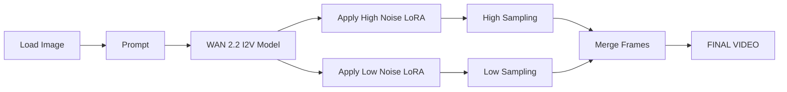

# Guide to using ComfyUI with WAN 2.2 - Image to Video (I2V)
This guide details how to use the **Wan 2.2 checkpoint** to generate videos from an image in **ComfyUI**, including LoRA integration. We cover practical examples of prompts and image-to-video workflows, and a step-by-step guide for loading LoRAs (ComfyUI nodes, application order, and scale adjustment). We also present the most relevant **parameters** (sampler, steps, CFG, denoising, seed, resolution, FPS, motion strength, keyframes), recommended value ranges, and practical rules of thumb. Finally, we discuss common pitfalls and known limitations (e.g., using T2V LoRAs with I2V models), compatibility issues, and recommendations on what to avoid.

## Technical Description of Wan 2.2

**Wan 2.2** is a multimodal video generation model (developed by Wan AI/Alibaba) released as open source under the Apache 2.0 license. It uses a large **Mixture-of-Experts (MoE)** architecture: two sub-models ("experts") are activated at different noise stages during synthesis, improving video quality without proportionally increasing computational cost.

During generation, approximately 14 billion parameters (out of roughly 27B total) are activated. The model automatically transitions from a high-noise stage (initial composition) to a low-noise stage (detail refinement). According to the official documentation, **Wan2.2-I2V-A14B** converts static images into dynamic videos while maintaining content consistency and smooth transitions.

Its native format supports videos up to **720p at 24 FPS**, although typical workflows often use lower resolutions (such as 832×480) to reduce memory consumption and speed up rendering. Compared to Wan 2.1, Wan 2.2 provides a significant improvement in cinematic aesthetics, complex motion generation, and understanding of sophisticated scenes.

> A compact 5B version (**Wan2.2-TI2V-5B**) is also available, capable of running image-to-video and text-to-video workflows at 720p on GPUs with approximately 8 GB of VRAM.

## Resources and Associated Files on CivitAI

WAN 2.2 models are officially hosted on Hugging Face and mirrored by several community platforms such as [CivitAI](https://civitai.com/). However, most ComfyUI users do not need to download these files manually.

Through the tab *Browse Templates*, ComfyUI can automatically load WAN 2.2 workflows and download any missing model components, including:

- WAN 2.2 High Noise model
- WAN 2.2 Low Noise model
- UMT5 text encoder
- VAE files

Manual downloads are mainly useful for offline installations, custom workflows, or users who want specific community checkpoints and LoRAs.

For installation, checkpoint files should be placed inside:

```text
ComfyUI/models/
```

Common files for the 14B I2V model include:

```text
wan2.2_i2v_high_noise_14B_fp8_scaled.safetensors
wan2.2_i2v_low_noise_14B_fp8_scaled.safetensors
umt5_xxl_fp8_e4m3fn_scaled.safetensors
wan_2.1_vae.safetensors
```

## Prompt and Image-to-Video Workflow Examples

When generating videos, prompts should describe not only the scene but also **camera movement and action**.

Example:

> A warrior fights an opponent with determined eyes. The camera moves forward as he fights, emphasizing the character's strength and heroic spirit.

Keywords such as **camera push-in**, **zoom out**, **pan**, and **tilt** help control camera movement.

A typical workflow uses the **Wan2.2 I2V 14B** or **Wan2.2 5B** template:

1. Load the source image using **Load Image**.
2. Connect it to the Wan 2.2 model.
3. Enter the prompt in the text encoder node.
4. Run the sampler (**KSampler** or **ModelSamplingSD**).
5. Export the resulting video.

Additional templates such as **First-Last Frame**, **Wan2.2 Fun InP**, **Wan2.2 Fun Control**, and **Wan2.2 Animate** provide specialized workflows for interpolation, pose control, depth guidance, and animation tasks.

## LoRA Integration and Usage in ComfyUI

LoRAs can be used to accelerate generation or apply specific visual styles.

For example, **Wan2.2 Lightning** provides high-noise and low-noise LoRAs that allow generation using only 8 steps (4 High + 4 Low).

In ComfyUI, LoRAs are loaded using:

- **LoRALoader**
- **Power LoRA Loader (RGThree)**

Recommended workflow:

```text
WAN2.2 HighNoise -> Load LoRA (High) -> KSampler
WAN2.2 LowNoise  -> Load LoRA (Low)  -> KSampler
```

Each LoRA receives its own **scale** value. A scale of **1.0** is typically a good starting point, with values up to **2.0** used for stronger effects.

Important:

- Use **I2V LoRAs** with I2V models.
- Do not use **T2V LoRAs** with I2V workflows.
- Place `.safetensors` LoRA files inside:

```text
ComfyUI/models/loras/
```

## Relevant Parameters and Recommendations

| Parameter | Typical Values | Notes |
|------------|---------------|-------|
| Sampler | Euler a, res_2s, res_2m | Euler is the most stable choice. |
| Steps | 8–12 (Lightning), 20–30 (Full) | More steps generally improve quality. |
| CFG Scale | 2.0 (Lightning), 3–5 (Standard) | Avoid CFG = 1. |
| Seed | Fixed or Random | Small configuration changes may dramatically alter results. |
| Resolution | 832×480 or 1280×720 | Higher resolutions require significantly more VRAM. |
| FPS | 24–27 | 81 frames at 27 FPS ≈ 3 seconds. |
| Motion Strength | Around 1.0 | Lower values create subtler motion. |
| Keyframes | 1–N | Used in interpolation workflows. |

### Practical Guidelines

- If VRAM is limited, prefer the **5B** model.
- Use **Euler** for maximum stability.
- Use **81 frames** for short clips.
- Keep CFG around **3–4**.
- Record seeds when reproducibility is important.

## Pitfalls, Limitations, and Compatibility

### LoRA Compatibility

Always use LoRAs designed for the target workflow. Using a Text-to-Video LoRA in an Image-to-Video model can severely degrade output quality.

### Wan 2.1 vs Wan 2.2 LoRAs

Some Wan 2.1 LoRAs may still work with Wan 2.2, but dedicated Wan 2.2 LoRAs generally provide better motion quality and cinematic consistency.

### VRAM Requirements

The Wan 2.2 14B model typically requires at least **20 GB of VRAM**. The 5B model is significantly lighter and more practical for consumer hardware.

### Seed Behavior

Even with the same seed, changes in resolution, frame count, or workflow configuration can produce substantially different videos.

### LoRA Node Organization

Use separate LoRA Loader nodes when necessary and ensure each LoRA is connected to the correct High Noise or Low Noise branch.

## Example Comparison Table

| Model | Parameters | VRAM Requirement | Estimated RTX 4090 Time | Quality |
|---------|-----------|-----------------|-------------------------|---------|
| Wan2.2 14B I2V | 14B | ~20 GB | ~1h 20m (81 frames) | Very High |
| Wan2.2 TI2V 5B | 5B | ~8 GB | ~6 min (81 frames) | Good |

## Basic Workflow Diagram



## Additional Resources

- CivitAI: Wan2.2 All-In-One, Wan2.2 I2V GGUF, Wan2.2 Lightning LoRAs.
- Hugging Face: Wan2.2-I2V-A14B, Wan2.2-TI2V-5B, Wan2.2-Lightning.
- GitHub: Wan AI repositories.
- ComfyUI documentation and official templates.
- Community tutorials and workflow examples.

By following these recommendations and experimenting with the parameters described above, it is possible to achieve high-quality AI-generated video results while minimizing common issues when using Wan 2.2 in ComfyUI.

###########################


# WAN 2.2 Models (I2V) – Overview

WAN 2.2 is a multimodal video generation model (text-to-video and image-to-video) based on a **Mixture of Experts (MoE)** architecture, featuring two sub-models specialized for different noise levels. In practice, this means there are two separate checkpoints: a **high-noise** model and a **low-noise** model, each operating during different stages of the diffusion process.

For ComfyUI, you must load both WAN 2.2 models (high and low noise) together with an appropriate text encoder (such as UMT5) and a VAE. For example, the Stable Diffusion Art tutorial recommends downloading files such as:

- `wan2.2_i2v_high_noise_14B_fp8_scaled.safetensors`
- `wan2.2_i2v_low_noise_14B_fp8_scaled.safetensors`

along with the appropriate VAE.

## Using LoRAs with WAN 2.2 in ComfyUI

WAN 2.2 was not trained on NSFW content, and many users rely on LoRAs to modify style, realism, cinematic appearance, or other visual characteristics.

### Single LoRA (No High/Low Variants)

If a LoRA is provided as a single file rather than separate high-noise and low-noise versions, connect the same LoRA to both model branches. This ensures the adaptation is applied throughout the entire diffusion process.

### Specialized LoRAs

In practice:

- Motion and action LoRAs tend to work best on the high-noise model.
- Detail and aesthetic LoRAs tend to work best on the low-noise model.

The high-noise model establishes the overall structure, while the low-noise model refines fine details.

### LoRA Placement

In ComfyUI, place `LoraLoaderModelOnly` nodes between the model loading node (`UNetLoader`) and the sampler.

Correct:

```text
UNetLoader → LoRA → ModelSamplingSD3 → KSampler
```

Incorrect:

```text
UNetLoader → KSampler → LoRA
```

## LoRA Strength Settings

There are no official strength values for WAN 2.2. Most users start around **1.0** and adjust from there.

### Motion LoRAs

Typical example:

```text
High Noise: 1.0
Low Noise: 0.4
```

Some users increase the high-noise value to around 1.6 when stronger motion is required.

### Style / Detail LoRAs

Typical example:

```text
High Noise: 0.4
Low Noise: 1.0
```

### Equal Strengths

Using identical values on both branches is also valid. A common recommendation is:

1. Start at 1.0.
2. Increase gradually if the effect is too weak.
3. Decrease if artifacts or overcooking appear.

## ModelSamplingSD3 (Shift)

`ModelSamplingSD3` is a built-in ComfyUI node that modifies diffusion sampling behavior by applying a **shift** value to the model.

### Recommended Placement

The node is normally placed after all model modifications (LoRAs, NAG, SLG, etc.) and before the sampler.

Example:

```text
UNetLoader
   ↓
LoRA
   ↓
ModelSamplingSD3
   ↓
KSampler
```

### Shift Parameter

Default value:

```text
3.0
```

Typical WAN 2.2 workflows use:

```text
5.0
```

Higher values generally introduce more variation and can slightly alter the artistic characteristics of the output.

## KSamplerAdvanced: High Noise and Low Noise

WAN 2.2 typically uses two `KSamplerAdvanced` nodes.

### High-Noise KSampler

Example configuration:

```text
add_noise = enable
start_at_step = 0
end_at_step = 10
```

This sampler performs the initial diffusion steps and injects noise.

### Low-Noise KSampler

Example configuration:

```text
add_noise = disable
start_at_step = 10
end_at_step = 20
```

This sampler continues the denoising process and refines the latent representation produced by the high-noise stage.

## Useful Workflows and Resources

### Stable Diffusion Art

Detailed WAN 2.2 I2V setup guide, including downloads and workflow examples.

### ComfyUI Documentation

Official documentation covering both I2V and T2V workflows.

### Community Resources

Users frequently share workflows through:

- CivitAI
- Reddit
- YouTube
- GitHub repositories

## Parameters, Ranges, and Common Pitfalls

### Steps

Typical range:

```text
15–25
```

Lightning LoRAs can reduce this to:

```text
4
```

### CFG Scale

Typical range:

```text
3.0–7.0
```

Many users prefer:

```text
3.5
```

Values above 7 may create artifacts.

### Seeds

Fixed seeds improve consistency between generations.

### Scheduler

Common options:

- Simple
- Karras

Simple is faster, while Karras may offer slightly better quality.

### VAE Selection

For WAN 2.2 14B I2V:

```text
Use the WAN 2.1 VAE.
```

For WAN 2.2 5B:

```text
Use the WAN 2.2 VAE.
```

Avoid mixing them incorrectly.

## Common Mistakes

### Incorrect LoRA Placement

Always place LoRAs before the sampler.

### Ignoring the High-Noise Model

Using only the low-noise model significantly reduces quality.

### Lightning LoRA Step Counts

If a Lightning LoRA is designed for 4 steps, update both KSampler nodes accordingly.

### Outdated ComfyUI Installation

WAN 2.2 depends on recent fixes and nodes. Keep ComfyUI updated.

### Quality vs Speed

Fast workflows sacrifice detail. If videos appear washed out or foggy:

- Increase steps.
- Increase CFG slightly.

If generation is too slow:

- Use Lightning LoRAs.
- Reduce resolution.
- Switch to the 5B model.

## Final Notes

Working effectively with WAN 2.2 in ComfyUI requires understanding both the high-noise and low-noise stages of the model. By correctly configuring ModelSamplingSD3, splitting diffusion across two KSamplerAdvanced nodes, applying LoRAs appropriately, and tuning strengths and sampling parameters, it is possible to achieve high-quality video generation results while avoiding common workflow mistakes.
