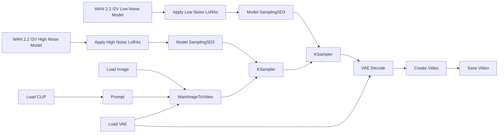
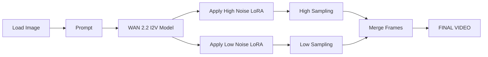

# Guide to using ComfyUI with WAN 2.2 - Image to Video (I2V)

## How diffusion models work

A **diffusion model** is a type of generative AI that creates images or videos through an iterative denoising process. During training, the model learns how to recover visual information from data that has been progressively corrupted with random noise. During generation, it performs the reverse operation, starting from noise and gradually refining it over many steps into coherent visual content guided by conditioning inputs such as text prompts, images, or other control signals. This approach enables diffusion models to produce highly detailed and visually consistent results.

## Technical Description of WAN 2.2

**Wan 2.2** is a multimodal diffusion-based video generation model (developed by Wan AI/Alibaba) released as open source. It uses a large **Mixture-of-Experts** (MoE) architecture. In practice, this means the generation process is split into stages specialized for different noise levels:

- **High-noise stage**: builds the global structure, movement, and composition.
- **Low-noise stage**: refines details, consistency, and visual polish.

For I2V, the model turns a still image into a video while trying to preserve the identity, layout, and style of the source image.

## Basic Workflow Diagram

Although WAN 2.2 internally uses separate high-noise and low-noise stages, most ComfyUI workflows expose these stages as distinct nodes and checkpoints. The image and prompt are first converted into conditioning information, then the generation process is split into two phases. The outputs of these stages are combined to produce the final video. In Lightning workflows, specialized LoRAs are often applied to both stages, allowing the model to generate high-quality results with very few sampling steps.



1. **WAN 2.2 I2V High Noise Model**  
   The model used during the first stage of generation. It operates in the high-noise region of the diffusion process, where the main goal is to establish motion, composition, scene structure, and overall dynamics.

2. **Apply High Noise LoRAs**  
   Applies LoRAs to the high-noise model. These LoRAs modify the model's behavior without changing the base checkpoint and are often used to improve motion, realism, style, or accelerate generation in Lightning workflows.

3. **Model SamplingSD3**  
   Configures the model for the sampling process. In practice, it prepares the checkpoint so that the sampler can perform the denoising steps correctly.

4. **KSampler (High Noise Stage)**  
   Executes the denoising steps for the high-noise stage. This phase establishes the overall structure of the video, including movement, camera direction, and large-scale visual features.

5. **WAN 2.2 I2V Low Noise Model**  
   The model used during the second stage of generation. It focuses on refining information that was established during the high-noise stage rather than creating new structure.

6. **Apply Low Noise LoRAs**  
   Applies LoRAs to the low-noise model. These LoRAs typically enhance refinement, detail quality, texture consistency, and overall visual polish.

7. **Model SamplingSD3**  
   Performs the same role as in the high-noise branch, preparing the low-noise model for the denoising process.

8. **KSampler (Low Noise Stage)**  
   Executes the denoising steps for the low-noise stage. This phase refines details, improves temporal consistency, and produces a cleaner final result.

9. **Load Image**  
   Loads the source image that serves as the starting point for Image-to-Video generation. The model uses this image as a reference for appearance, composition, and subject identity.

10. **WanImageToVideo**  
    The central node that prepares the Image-to-Video conditioning. It combines information from the source image, text prompt, CLIP encoder, and VAE to create the inputs required by the diffusion process.

11. **Load CLIP**  
    Loads the text encoder used to interpret prompts. The encoded text is converted into conditioning information that guides the video generation process.

12. **Prompt**  
    The text description that guides the generation. Prompts can influence content, actions, camera movement, style, atmosphere, and other visual characteristics.

13. **Load VAE**  
    Loads the Variational Autoencoder (VAE), which is responsible for converting between pixel space and latent space. Diffusion takes place in latent space because it is significantly more efficient.

14. **VAE Decode**  
    Converts the final latent representation into visible video frames. This is the stage where the compressed internal representation becomes actual images.

15. **Create Video**  
    Combines the decoded frames into a continuous video sequence using the selected frame rate and encoding settings.

16. **Save Video**  
    Exports the completed video file to disk, making the generated result available for viewing or further processing.

### Lightning / LightX2V Workflows

Some WAN 2.2 workflows use optional LightX2V (Lightning) LoRAs designed specifically for the high-noise and low-noise stages. These LoRAs are applied on top of the corresponding checkpoints and allow the model to generate videos using dramatically fewer sampling steps, reducing generation time and hardware requirements.

While Lightning workflows can be significantly faster, they may sacrifice some generation flexibility and, depending on the scene, can produce less dynamic motion or lower overall quality compared to standard workflows. For this reason, many users choose the standard workflow when maximizing quality is the priority, and reserve Lightning workflows for rapid iteration and experimentation.

## Required files

For a standard ComfyUI setup, you usually need the following files:

- **`wan2.2_i2v_high_noise_14B_fp8_scaled.safetensors`**  
  The high-noise checkpoint. It is responsible for the first part of the diffusion process, where the model decides motion, composition, and broad structure.

- **`wan2.2_i2v_low_noise_14B_fp8_scaled.safetensors`**  
  The low-noise checkpoint. It refines the video after the main structure is already in place.

- **`umt5_xxl_fp8_e4m3fn_scaled.safetensors`**  
  The text encoder. It converts the prompt into features the model can use.

- **VAE file**  
  Usually the VAE provided for WAN 2.2 / WAN 2.1-compatible workflows. The VAE is what helps decode the latent representation into an actual image/video output.

- **Optional LoRA files**  
  Used to add style, motion, realism, or other visual behaviors without retraining the full model.

> A latent representation is a compressed version of an image or video that preserves its most important visual information. WAN 2.2 performs diffusion in this compressed space for efficiency, and the VAE later converts it back into normal pixels.

## Low noise vs. high noise

### High-noise stage
This stage comes first and is the most important for:

- initial motion
- camera direction
- scene layout
- large shape placement
- overall energy of the clip

### Low-noise stage
This stage comes after the structure is already defined and is responsible for:

- sharper details
- cleaner textures
- better temporal coherence
- less visual instability
- more polished final frames

## Why many Lightning workflows use 2 steps for each stage

In the **Lightning** style workflow, it is common to see something like:

- **2 high-noise steps**
- **2 low-noise steps**

This is not arbitrary. It works because Lightning LoRAs are designed to make the model usable with **very few denoising steps**. The practical logic is:

- The **first 2 steps** give enough room to establish motion and composition.
- The **next 2 steps** refine the output without wasting time on unnecessary denoising passes.

So the model does not need many steps because the LoRA is already pushing it toward a fast, compressed generation path.

In a **full, non-Lightning workflow**, the same idea still applies, but the total step count is usually higher.

## Resources and Associated Files on CivitAI

WAN 2.2 files are commonly found through official sources and community mirrors such as **CivitAI**.

In practice, many users do not download everything manually.  
ComfyUI templates can often fetch the needed components automatically through **Browse Templates**.

Typical resources include:

- WAN 2.2 **High Noise** checkpoint
- WAN 2.2 **Low Noise** checkpoint
- **UMT5** text encoder
- **VAE** files
- community **LoRAs**
- ready-made **ComfyUI workflows**

### Why this matters

This is helpful because WAN 2.2 workflows often break when one file is missing or mismatched.  
Having the correct set of files avoids:

- model loading errors
- incompatible LoRA behavior
- broken prompt encoding
- poor video quality caused by wrong VAE selection

### Practical file organization

A common structure is:

```text
ComfyUI/models/
```

For LoRAs:

```text
ComfyUI/models/loras/
```

## Using LoRA

### What is a LoRA?

A **LoRA** (Low-Rank Adaptation) is a lightweight model add-on used to modify behavior without retraining the whole model.

With WAN 2.2, LoRAs are often used to:

- add a specific visual style
- increase realism
- improve cinematic behavior
- guide motion
- adapt the model to a niche aesthetic
- compensate for limitations in the base model

### Why LoRAs matter with WAN 2.2

WAN is not trained as an NSFW-focused model.  
Because of that, many users rely on LoRAs to push the output toward specific styles or domains.

That said, the main point is broader than NSFW alone:

- the base model gives you a general foundation
- the LoRA gives you a specialized behavior layer

So LoRAs are useful for many purposes, not only for content restrictions.

### One LoRA file vs. separate high/low versions

This is one of the most important practical points.

#### Case 1: the LoRA is a single file

If the LoRA is delivered as **one file only**, apply the same LoRA to **both** branches:

- high-noise branch
- low-noise branch

This keeps the adaptation present across the full denoising process.

#### Case 2: the LoRA has separate versions

Some LoRAs are built with different strengths or files for:

- high-noise behavior
- low-noise behavior

In that case:

- use the **high-noise LoRA** on the high-noise branch
- use the **low-noise LoRA** on the low-noise branch

### Why one LoRA may be enough for both branches

If you only connect a LoRA to one stage, the effect may fade or become inconsistent.

Applying the same LoRA to both branches helps because:

- the first stage sets the main direction
- the second stage keeps the same style while refining the result

That is especially useful for:

- style LoRAs
- character consistency
- realistic rendering
- branded aesthetics

### High-noise vs. low-noise LoRA behavior

In practice:

- **motion / action LoRAs** often feel stronger on the **high-noise** stage
- **detail / style LoRAs** often feel stronger on the **low-noise** stage

This is not a strict rule, but it is a good mental model.

### LoRA placement in ComfyUI

Place LoRA nodes **before** the sampler.

Correct flow:

```text
UNetLoader → LoRA → ModelSamplingSD3 → KSampler
```

Incorrect flow:

```text
UNetLoader → KSampler → LoRA
```

The LoRA must influence the model before sampling begins.

---

## LoRA Strength Settings

There is no universal perfect value.  
A good starting point is usually **1.0**.

### Good starting points

- **Style / realism LoRA**
  - high noise: `0.4` to `1.0`
  - low noise: `0.7` to `1.2`

- **Motion LoRA**
  - high noise: `1.0` to `1.6`
  - low noise: `0.3` to `0.8`

### Practical rules

- Start with **1.0** if you do not know the LoRA yet.
- Increase gradually if the effect is too weak.
- Lower the value if the output becomes overcooked, unstable, or noisy.
- If the effect is too subtle, test the high-noise branch first for motion-focused LoRAs.
- If the output loses detail, reduce the low-noise strength first for style-heavy LoRAs.

### Common balancing pattern

A common setup looks like this:

- **High noise = stronger for motion**
- **Low noise = stronger for details**

Example:

```text
Motion LoRA:
High = 1.2
Low  = 0.5

Style LoRA:
High = 0.6
Low  = 1.0
```

## ModelSamplingSD3 (Shift)

`ModelSamplingSD3` is a ComfyUI node used to adjust how the model behaves during sampling.

### What the shift does

The **shift** value changes the diffusion behavior in a way that can affect:

- stability
- style
- motion character
- overall generation feel

### Where to place it

It should usually come **after** the model modifications and **before** the sampler:

```text
UNetLoader
   ↓
LoRA
   ↓
ModelSamplingSD3
   ↓
KSampler
```

### Typical values

A common starting point is:

```text
3.0
```

Many WAN 2.2 workflows use values around:

```text
5.0
```

### Practical advice

- Use the default or near-default value first.
- Increase the shift only if you understand how it changes the output.
- Too much shift can make results feel less stable or less faithful to the prompt/image.

## KSampler (Advanced)

WAN 2.2 workflows often split sampling across **two KSampler (Advanced)** nodes:

- one for **high noise**
- one for **low noise**

### High-noise KSampler

This sampler is responsible for the first part of the denoising process.

Typical settings:

```text
add_noise = enable
start_at_step = 0
end_at_step = 10
```

Its role is to:

- inject or manage noise
- create the initial movement structure
- establish the rough visual plan

### Low-noise KSampler

This sampler continues the generation after the structure is already established.

Typical settings:

```text
add_noise = disable
start_at_step = 10
end_at_step = 20
```

Its role is to:

- refine the latent
- sharpen details
- improve coherence
- stabilize the final look

### Why split the process in two?

Splitting the process lets you control the generation more precisely.

It also matches the internal logic of WAN 2.2:

- the first stage is for broad structure
- the second stage is for refinement

This is why many workflows pair WAN 2.2 with two samplers rather than one.

---

## Parameters, Ranges, and Common Pitfalls

### Steps

Typical ranges:

- **Lightning workflows**: `4` total steps, often split as `2 + 2`
- **Standard workflows**: `15–25`
- **Higher-quality full workflows**: sometimes more, depending on hardware

More steps can improve detail, but they also increase time.

### CFG Scale

Typical range:

- `3.0–7.0`

Common practical values:

- `3.5` for a balanced result
- `2.0` to `3.0` in compressed or Lightning-style workflows

Too much CFG can cause artifacts or overly rigid results.

### Resolution

Common practical resolutions:

- `832×480`
- `1280×720`

Higher resolution usually means:

- more VRAM usage
- slower generation
- higher risk of running out of memory

### FPS

A common range is:

- `24–27 FPS`

For short clips, the frame count matters as much as the FPS.

### Seed

A fixed seed is useful when you want reproducibility.

A random seed is better when exploring variations.

### Scheduler

Common options include:

- **Simple**
- **Karras**

A simple scheduler is often easier to test.  
Karras can sometimes produce smoother behavior.

### VAE selection

A practical rule is:

- **14B I2V**: use the WAN 2.1-compatible VAE
- **5B**: use the VAE intended for the 5B workflow

Mixing them incorrectly can hurt quality.

### VRAM considerations

The **14B model** is much heavier.  
For many users, it requires a high-memory GPU.

The **5B model** is the fallback when:

- VRAM is limited
- faster iteration matters
- you want a lighter test workflow

### Common pitfalls

- using the wrong LoRA type
- placing LoRA after the sampler
- using the wrong VAE
- mixing 5B and 14B resources
- expecting the same seed to behave identically after changing resolution or frame count
- increasing CFG too much
- using too many steps in a Lightning workflow

---

## Common Mistakes

### 1. Using the wrong LoRA branch

If a LoRA has separate high-noise and low-noise versions, do not attach them randomly.

Use the matching branch.

### 2. Ignoring the high-noise stage

The high-noise stage is where the clip gets its structure and motion.  
Skipping it or weakening it too much usually gives poor results.

### 3. Placing LoRA too late

LoRA must affect the model before sampling.  
If it is added too late, the effect is reduced or lost.

### 4. Mixing incompatible files

A wrong checkpoint, encoder, or VAE can quietly destroy quality even if the workflow still runs.

### 5. Overusing steps in Lightning

Lightning workflows are meant to be fast.  
If the model is optimized for few steps, adding many more does not always help.

### 6. Pushing strength too hard

A very strong LoRA can create:

- texture artifacts
- unstable motion
- over-stylized frames
- identity drift

### 7. Treating the 5B model like the 14B model

The 5B version is lighter and more practical for limited hardware, but it is not the same quality target as the 14B workflow.

## Summary

The most practical way to work with WAN 2.2 in ComfyUI is to think in stages:

- the **high-noise model** creates the structure
- the **low-noise model** cleans it up
- the **LoRA** adds specialization
- the **sampler settings** decide how fast and how stable the result will be

For most users, the **14B model** is the main target, while the **5B model** is the lighter fallback.

If you keep the branches aligned, place LoRAs correctly, and avoid mismatched files, WAN 2.2 becomes much easier to use in practice.

##########################################################################

# Guide to using ComfyUI with WAN 2.2 - Image to Video (I2V)
This guide details how to use the **Wan 2.2 checkpoint** to generate videos from an image in **ComfyUI**, including LoRA integration. We cover practical examples of prompts and image-to-video workflows, and a step-by-step guide for loading LoRAs (ComfyUI nodes, application order, and scale adjustment). We also present the most relevant **parameters** (sampler, steps, CFG, denoising, seed, resolution, FPS, motion strength, keyframes), recommended value ranges, and practical rules of thumb. Finally, we discuss common pitfalls and known limitations (e.g., using T2V LoRAs with I2V models), compatibility issues, and recommendations on what to avoid.

## Technical Description of Wan 2.2

**Wan 2.2** is a multimodal video generation model (developed by Wan AI/Alibaba) released as open source under the Apache 2.0 license. It uses a large **Mixture-of-Experts (MoE)** architecture: two sub-models ("experts") are activated at different noise stages during synthesis, improving video quality without proportionally increasing computational cost.

During generation, approximately 14 billion parameters (out of roughly 27B total) are activated. The model automatically transitions from a high-noise stage (initial composition) to a low-noise stage (detail refinement). According to the official documentation, **Wan2.2-I2V-A14B** converts static images into dynamic videos while maintaining content consistency and smooth transitions.

Its native format supports videos up to **720p at 24 FPS**, although typical workflows often use lower resolutions (such as 832×480) to reduce memory consumption and speed up rendering. Compared to Wan 2.1, Wan 2.2 provides a significant improvement in cinematic aesthetics, complex motion generation, and understanding of sophisticated scenes.

> A compact 5B version (**Wan2.2-TI2V-5B**) is also available, capable of running image-to-video and text-to-video workflows at 720p on GPUs with approximately 8 GB of VRAM.

## Resources and Associated Files on CivitAI

WAN 2.2 models are officially hosted on Hugging Face and mirrored by several community platforms such as [CivitAI](https://civitai.com/). However, most ComfyUI users do not need to download these files manually. Through the tab *Browse Templates*, ComfyUI can automatically load WAN 2.2 workflows and download any missing model components, including:

- WAN 2.2 High Noise model
- WAN 2.2 Low Noise model
- UMT5 text encoder
- VAE files

Manual downloads are mainly useful for offline installations, custom workflows, or users who want specific community checkpoints and LoRAs.

For installation, checkpoint files should be placed inside:

```text
ComfyUI/models/
```

Common files for the 14B I2V model include:

```text
wan2.2_i2v_high_noise_14B_fp8_scaled.safetensors
wan2.2_i2v_low_noise_14B_fp8_scaled.safetensors
umt5_xxl_fp8_e4m3fn_scaled.safetensors
wan_2.1_vae.safetensors
```

## Prompt and Image-to-Video Workflow Examples

When generating videos, prompts should describe not only the scene but also **camera movement and action**.

Example:

> A warrior fights an opponent with determined eyes. The camera moves forward as he fights, emphasizing the character's strength and heroic spirit.

Keywords such as **camera push-in**, **zoom out**, **pan**, and **tilt** help control camera movement.

A typical workflow uses the **Wan2.2 I2V 14B** or **Wan2.2 5B** template:

1. Load the source image using **Load Image**.
2. Connect it to the Wan 2.2 model.
3. Enter the prompt in the text encoder node.
4. Run the sampler (**KSampler** or **ModelSamplingSD**).
5. Export the resulting video.

Additional templates such as **First-Last Frame**, **Wan2.2 Fun InP**, **Wan2.2 Fun Control**, and **Wan2.2 Animate** provide specialized workflows for interpolation, pose control, depth guidance, and animation tasks.

## LoRA Integration and Usage in ComfyUI

LoRAs can be used to accelerate generation or apply specific visual styles.

For example, **Wan2.2 Lightning** provides high-noise and low-noise LoRAs that allow generation using only 8 steps (4 High + 4 Low).

In ComfyUI, LoRAs are loaded using:

- **LoRALoader**
- **Power LoRA Loader (RGThree)**

Recommended workflow:

```text
WAN2.2 HighNoise -> Load LoRA (High) -> KSampler
WAN2.2 LowNoise  -> Load LoRA (Low)  -> KSampler
```

Each LoRA receives its own **scale** value. A scale of **1.0** is typically a good starting point, with values up to **2.0** used for stronger effects.

Important:

- Use **I2V LoRAs** with I2V models.
- Do not use **T2V LoRAs** with I2V workflows.
- Place `.safetensors` LoRA files inside:

```text
ComfyUI/models/loras/
```

## Relevant Parameters and Recommendations

| Parameter | Typical Values | Notes |
|------------|---------------|-------|
| Sampler | Euler a, res_2s, res_2m | Euler is the most stable choice. |
| Steps | 8–12 (Lightning), 20–30 (Full) | More steps generally improve quality. |
| CFG Scale | 2.0 (Lightning), 3–5 (Standard) | Avoid CFG = 1. |
| Seed | Fixed or Random | Small configuration changes may dramatically alter results. |
| Resolution | 832×480 or 1280×720 | Higher resolutions require significantly more VRAM. |
| FPS | 24–27 | 81 frames at 27 FPS ≈ 3 seconds. |
| Motion Strength | Around 1.0 | Lower values create subtler motion. |
| Keyframes | 1–N | Used in interpolation workflows. |

### Practical Guidelines

- If VRAM is limited, prefer the **5B** model.
- Use **Euler** for maximum stability.
- Use **81 frames** for short clips.
- Keep CFG around **3–4**.
- Record seeds when reproducibility is important.

## Pitfalls, Limitations, and Compatibility

### LoRA Compatibility

Always use LoRAs designed for the target workflow. Using a Text-to-Video LoRA in an Image-to-Video model can severely degrade output quality.

### Wan 2.1 vs Wan 2.2 LoRAs

Some Wan 2.1 LoRAs may still work with Wan 2.2, but dedicated Wan 2.2 LoRAs generally provide better motion quality and cinematic consistency.

### VRAM Requirements

The Wan 2.2 14B model typically requires at least **20 GB of VRAM**. The 5B model is significantly lighter and more practical for consumer hardware.

### Seed Behavior

Even with the same seed, changes in resolution, frame count, or workflow configuration can produce substantially different videos.

### LoRA Node Organization

Use separate LoRA Loader nodes when necessary and ensure each LoRA is connected to the correct High Noise or Low Noise branch.

## Example Comparison Table

| Model | Parameters | VRAM Requirement | Estimated RTX 4090 Time | Quality |
|---------|-----------|-----------------|-------------------------|---------|
| Wan2.2 14B I2V | 14B | ~20 GB | ~1h 20m (81 frames) | Very High |
| Wan2.2 TI2V 5B | 5B | ~8 GB | ~6 min (81 frames) | Good |

## Basic Workflow Diagram



## Additional Resources

- CivitAI: Wan2.2 All-In-One, Wan2.2 I2V GGUF, Wan2.2 Lightning LoRAs.
- Hugging Face: Wan2.2-I2V-A14B, Wan2.2-TI2V-5B, Wan2.2-Lightning.
- GitHub: Wan AI repositories.
- ComfyUI documentation and official templates.
- Community tutorials and workflow examples.

By following these recommendations and experimenting with the parameters described above, it is possible to achieve high-quality AI-generated video results while minimizing common issues when using Wan 2.2 in ComfyUI.

###########################


# WAN 2.2 Models (I2V) – Overview

WAN 2.2 is a multimodal video generation model (text-to-video and image-to-video) based on a **Mixture of Experts (MoE)** architecture, featuring two sub-models specialized for different noise levels. In practice, this means there are two separate checkpoints: a **high-noise** model and a **low-noise** model, each operating during different stages of the diffusion process.

For ComfyUI, you must load both WAN 2.2 models (high and low noise) together with an appropriate text encoder (such as UMT5) and a VAE. For example, the Stable Diffusion Art tutorial recommends downloading files such as:

- `wan2.2_i2v_high_noise_14B_fp8_scaled.safetensors`
- `wan2.2_i2v_low_noise_14B_fp8_scaled.safetensors`

along with the appropriate VAE.

## Using LoRAs with WAN 2.2 in ComfyUI

WAN 2.2 was not trained on NSFW content, and many users rely on LoRAs to modify style, realism, cinematic appearance, or other visual characteristics.

### Single LoRA (No High/Low Variants)

If a LoRA is provided as a single file rather than separate high-noise and low-noise versions, connect the same LoRA to both model branches. This ensures the adaptation is applied throughout the entire diffusion process.

### Specialized LoRAs

In practice:

- Motion and action LoRAs tend to work best on the high-noise model.
- Detail and aesthetic LoRAs tend to work best on the low-noise model.

The high-noise model establishes the overall structure, while the low-noise model refines fine details.

### LoRA Placement

In ComfyUI, place `LoraLoaderModelOnly` nodes between the model loading node (`UNetLoader`) and the sampler.

Correct:

```text
UNetLoader → LoRA → ModelSamplingSD3 → KSampler
```

Incorrect:

```text
UNetLoader → KSampler → LoRA
```

## LoRA Strength Settings

There are no official strength values for WAN 2.2. Most users start around **1.0** and adjust from there.

### Motion LoRAs

Typical example:

```text
High Noise: 1.0
Low Noise: 0.4
```

Some users increase the high-noise value to around 1.6 when stronger motion is required.

### Style / Detail LoRAs

Typical example:

```text
High Noise: 0.4
Low Noise: 1.0
```

### Equal Strengths

Using identical values on both branches is also valid. A common recommendation is:

1. Start at 1.0.
2. Increase gradually if the effect is too weak.
3. Decrease if artifacts or overcooking appear.

## ModelSamplingSD3 (Shift)

`ModelSamplingSD3` is a built-in ComfyUI node that modifies diffusion sampling behavior by applying a **shift** value to the model.

### Recommended Placement

The node is normally placed after all model modifications (LoRAs, NAG, SLG, etc.) and before the sampler.

Example:

```text
UNetLoader
   ↓
LoRA
   ↓
ModelSamplingSD3
   ↓
KSampler
```

### Shift Parameter

Default value:

```text
3.0
```

Typical WAN 2.2 workflows use:

```text
5.0
```

Higher values generally introduce more variation and can slightly alter the artistic characteristics of the output.

## KSamplerAdvanced: High Noise and Low Noise

WAN 2.2 typically uses two `KSamplerAdvanced` nodes.

### High-Noise KSampler

Example configuration:

```text
add_noise = enable
start_at_step = 0
end_at_step = 10
```

This sampler performs the initial diffusion steps and injects noise.

### Low-Noise KSampler

Example configuration:

```text
add_noise = disable
start_at_step = 10
end_at_step = 20
```

This sampler continues the denoising process and refines the latent representation produced by the high-noise stage.

## Useful Workflows and Resources

### Stable Diffusion Art

Detailed WAN 2.2 I2V setup guide, including downloads and workflow examples.

### ComfyUI Documentation

Official documentation covering both I2V and T2V workflows.

### Community Resources

Users frequently share workflows through:

- CivitAI
- Reddit
- YouTube
- GitHub repositories

## Parameters, Ranges, and Common Pitfalls

### Steps

Typical range:

```text
15–25
```

Lightning LoRAs can reduce this to:

```text
4
```

### CFG Scale

Typical range:

```text
3.0–7.0
```

Many users prefer:

```text
3.5
```

Values above 7 may create artifacts.

### Seeds

Fixed seeds improve consistency between generations.

### Scheduler

Common options:

- Simple
- Karras

Simple is faster, while Karras may offer slightly better quality.

### VAE Selection

For WAN 2.2 14B I2V:

```text
Use the WAN 2.1 VAE.
```

For WAN 2.2 5B:

```text
Use the WAN 2.2 VAE.
```

Avoid mixing them incorrectly.

## Common Mistakes

### Incorrect LoRA Placement

Always place LoRAs before the sampler.

### Ignoring the High-Noise Model

Using only the low-noise model significantly reduces quality.

### Lightning LoRA Step Counts

If a Lightning LoRA is designed for 4 steps, update both KSampler nodes accordingly.

### Outdated ComfyUI Installation

WAN 2.2 depends on recent fixes and nodes. Keep ComfyUI updated.

### Quality vs Speed

Fast workflows sacrifice detail. If videos appear washed out or foggy:

- Increase steps.
- Increase CFG slightly.

If generation is too slow:

- Use Lightning LoRAs.
- Reduce resolution.
- Switch to the 5B model.

## Final Notes

Working effectively with WAN 2.2 in ComfyUI requires understanding both the high-noise and low-noise stages of the model. By correctly configuring ModelSamplingSD3, splitting diffusion across two KSamplerAdvanced nodes, applying LoRAs appropriately, and tuning strengths and sampling parameters, it is possible to achieve high-quality video generation results while avoiding common workflow mistakes.
